# Guía básica de php

## Comenzando 🚀

_Para ejecutar archivos de  php se necesita un servidor, en este caso usaremos una aplicación que nos ofrece un servidor local -> xampp server._

[Descargar xampp](https://www.apachefriends.org/es/download.html)


<br>
_Se necesitará ejecutar el control panel de xampp, este lo podrá encontrar en c:/xampp/xampp-control.exe_

<br>
_Una vez hecho esto, abriremos el navegador y ponemos la ruta -> http://localhost y observaremos que nuestro servidor estará disponible_
<br>
<br>

## Uso externo del servidor

_Para poder visualizar nuestro proyecto en php desde un dispositivo externo ya no usaremos la ruta de localhost, sino que usaremos la dirección ip del equipo que se está usando como servidor local_<br>

_Pasos_<br>
_Abrimos la consola de comando o shell e introducimos el comando -> ipconfig_

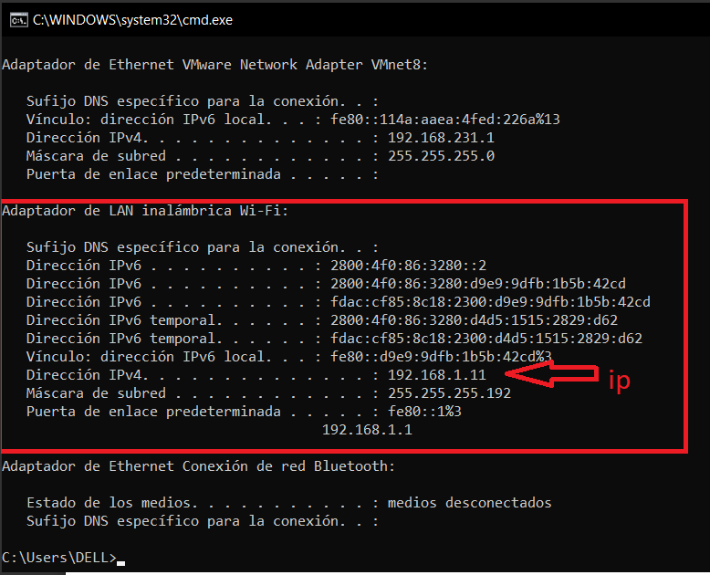<br>

_Econtramos la dirección ip del equipo (En este caso se está conectado a una red wifi), ahora podremos acceder desde otro equipo que esté conectado a la misma red por medio de esa ip: http://192.168.1.11:port, siendo port el puerto de http_
<br>

_En este caso trabajaremos con http://localhost (en el equipo local)_

## Ubiación de los archivos de php

_La ubicación en donde colocaremos nuestros archivos de php será en la carpeta htdocs dentro del directorio donde instalamos xampp._<br>
c:/xampp/htdocs/
<br>

_Dentro de ese directorio crearemos carpetas contenedores de cada proyecto_
<br>
<br>
_Comenzaremos creando una carpeta llamada test_php (o cualquier nombre de su preferencia, evite poner espacios a los archivos o directorios del proyecto), y dentro crearemos un archivo llamado index.php_
<br>
<br>

_ahora probaremos en el navegador con la ruta_ <br>
http://localhost/_nombre_de_carpeta/archivo
en este caso el nombre de la carpeta es test_php y el archivo index.php<br>
Quedaría así: http://localhost/test_php/index.php.<br>
Abrimos en un navegador y nos saldrá la pantalla en blanco ya que el archivo no posee contenido.
<br>
_Estamos listos._

## Comenzando 🚀

_Ya que tenemos preparado el ambiente para poder ejecutar archivos de php podemos empezar a codificar._

Abriremos el editor de código o ID de su preferencia (En este caso se usará Visual Studio Code).
<br>

<br>

_Ahora abriremos el directorio en vs-> file->open folder..._
<br>
Luego seleccionaremos el directorio de nuestro proyecto y lo abriremos

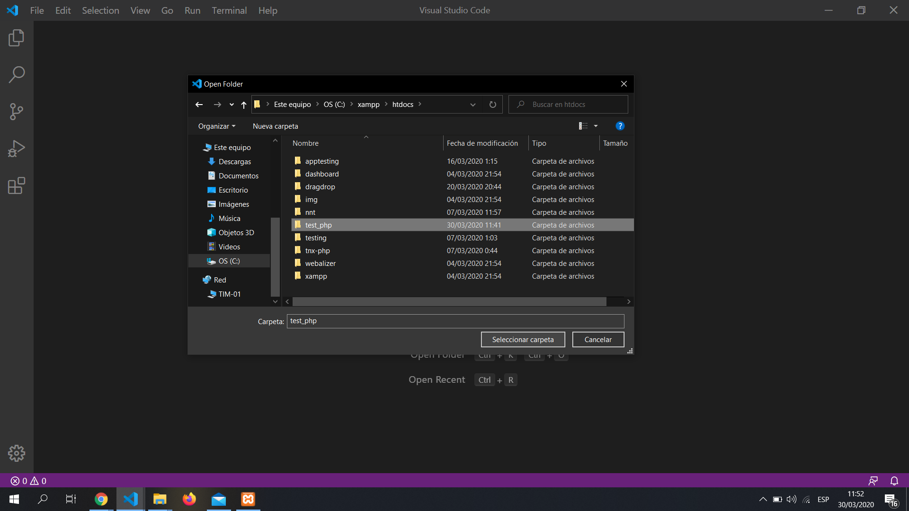<br>
_Luego tendremos esta vista_
<br>
_Seleccionaremos index.php para poder codificar_

### Codificando 📋

_Para poder empezar a codificar en php siempre empezaremos con:_

```php
<?php
```
```
Todo lo que esté dentro de esto será código php
```
_Y para cerrar usaremos:_

```php
?>
```
_Todo lo que esté fuera no será código php._

Nota: podemos tener código html dentro de un archivo php, pero esto se usa para las vistas de un proyecto, la lógica de programación es recomendable manejar en otros archivos .php.
<br>
<br>
Dentro del código html podemos incluir código php y funcionará, sin embargo, al momento de observar en el navegador no se podrá visualizar el código de php, sino los resultados mostrados, a continuación un ejemplo imprimiendo un mensaje dentro de una etiqueta de párrafo.
```php
<!DOCTYPE html>
<html lang="es">
<head>
    <meta charset="UTF-8">
    <title>Document</title>
</head>
<body>
    <p>
        <?php
            $saludo = "Hola ^^";
            echo $saludo;
        ?>
    </p>
</body>
</html>
```
Obtendremos el siguiente resultado en el cúal se mostró el texto que se imprimió por medio de php (las etiquetas HTML no se modificarán y podremos observar en las herramientas de desarrollador alt+f12).

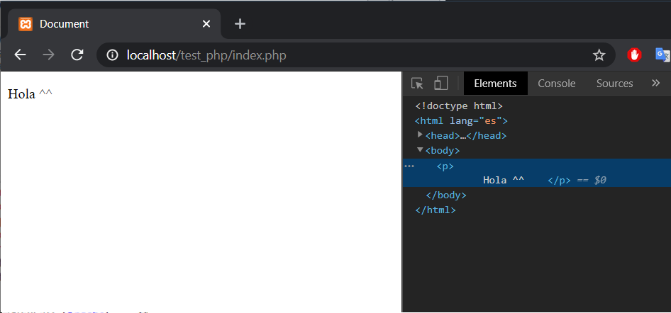<br>

_A partir de aquí codificaremos sólo en php y no tendremos ni una etiqueta html, sólo se pondrá en caso de ser necesario para mostrar información._

### Código 🔧
_Lo primero que siempre se aprende en cualquiér lenguaje de programación es imprimir un Hola mundo, para esto existe una función en php que lo hace posible, siendo esta llamada **"echo"** esta función sólo imprime texto plano, sea un simple string, números o valores booleanos (true or false), sin embargo, en algún momento usted quedrá imprimir algún objeto con sus datos, siendo este un arreglo, un objeto de clase o un objeto anónimo, para esto estiste la función **"var_dump(object)"**, a contuación sus usos._
```php
<?php
    // hola, soy un comentario
    // Voy a imprimir varios valores
    // Un string, siendo este rodeado por comillas simples'' o dobles "" 
    echo "mensaje"; // no te olvides del ";"
    // ojo, si intentas imprimir un mensaje sin las comillas, php lo entenderá como si fuera una constante y sin no la encuentra mostrará un error en la pantalla
    echo mensaje;
?>
```
Vista obtenida.
<br>
_No te asustes, php nos mostrará una advertencia, pero nosotros nos enfocaremos en la ubicación del archivo que tiene el error y la línea para poder corregirla._<br>
_Al principio nos imprimió el valor "mensaje", ya que este es un string y el valor está sin errores._

Ahora imprimiremos números y valores booleanos.

```php
<?php

    echo 55; // Intentaremos imprimir un número 
    echo true; // imrpimiremos "true" en el navegador
    echo false; // imrpimiremos "false" en el navegador
    // ojo, las palabras true y false ya están reservadas, por ende no mostrará ningún error
?>
```
<br>
_Vemos el resultado, observaremos algo extraño, nos ha imprimido el 551, en ves de 55   true   false._
<br>
En primer lugar,  los valores que se imrpimen ahí van seguidos sin espacio, porque siendo imprimidos estos, no hay ni un string y alguna etiqueta de html que los separe, sólo son texto plano, esto va así.<br>
```
Recorrer el código de php y encuentra la función echo que va a imprimir algo, en este caso el 55, lo imprime.
Tenemos el número 55 que se muestra en la pantalla, ahora sigue recorriendo, encuentra otra función echo, ahora con el valor de true, dicho valor cuándo va a ser impreso va a ser 1, por ende imprime el número 1, ahora ¿cómo se va a mostrar en pantalla?

Tenemos el 55 sin ningún espacio, así que el 1 irá a su derecha formando el 551, el valor de false, normalmente cuándo lo imprimimos con una función echo no mostrará nada.
```
En este momento imprimiremos varios valores, un string y números, pero con saltos de línea.
```php
<?php
echo "Hola xd";//Imprimimos un text
/*Ahora queremos un salto de línea, normalmente en cualquier lenguaje de programación usamos el \n para mostrar un salto de línea, pero en el navegador se va a mostrar como código HTML, entonces, usaremos una etiqueta html para mostrar un salto de línea, dicha etiqueta es <br>
Ahora, para poder usar esa etiqueta en php, no se tendrá que poner así nomas => <br>, ya que sería una sintaxis incorrecta del lenguaje, por ende vamos a imprimir como si fuera unn texto, html la convertirá en etiqueta, siempre y cuándo esté bien escrita.
*/
echo "<br>";
echo 55;
echo "<br>";
echo "salto";
?>
```

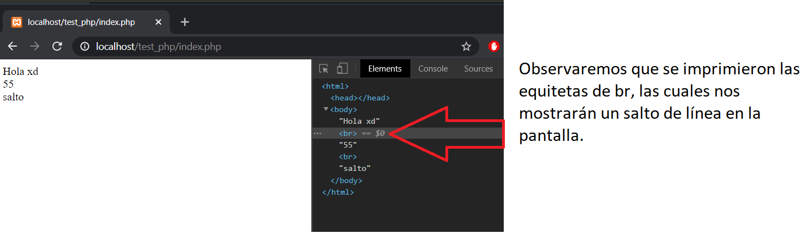<br>


_Podremos imprimir otras etiquetas html con algún contenido con php, usando la función echo:_
```php
<?php
echo "<div><p>Message</p></div>"
?>
```
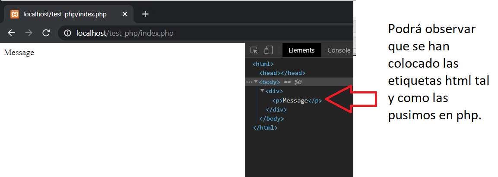<br>

_Ahora veremos un pequeño ejemplo de cómo imprimir valores con **var_dump(object)**_

```php
<?php
    // primero probaremos en datos primitivos como son los string, numbers, boolean
    var_dump("hola");
    echo "<br>"; // salto de línea
    var_dump(15);
    echo "<br>"; // salto de línea
    var_dump(true);
    echo "<br>"; // salto de línea
    var_dump(false);
    echo "<br>"; // salto de línea
    //Luego con algún objeto, en este caso un arreglo.
    var_dump([1,12,5]); // arreglo de números.
?>
```
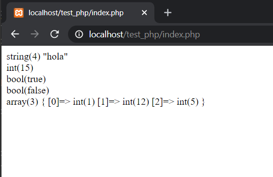<br>
Podremos observar los valores:<br>
* Primer valor: vemos el tipo de datos y su dimensión, a un lado vemos el mensaje impreso
* Segundo valor: vemos el tipo de dato y entre paréntesis el valor entero.
*  Tercer y cuarto valor: Vemos el tipo de dato y su valor, pero esta vez, los booleanos no se imprimieron con 1 y 0 ya que var_dump imprime los valores y tipos de datos.
* Cuarto valor: imprime el tipo de objeto (en este caso es array), la dimensión (el tamaño), y sus valores con la posición correspondiente a cada valor que contiene el arreglo y su tipo de dato.<br>

Nota.- si intentamos imprimir un objeto con echo nos saldría un error, ya que esta función sólo acepta valores primitivos.


### Variables 🔧

_Son aquellos contenedores de datos, dichos contendores pueden variar su contenido, en php las variables son dinámicas, ya que su contenido puede tener valores de tipo string y después cambiar a numeros, luego a objetos._

_Las variables se definene con el signo **$** al principio, **$variable=valor;**_<br>
_Ejemplo_

```php
<?php
    $variable = 133.45;
    echo $variable;
    $variable = "cambie de valor y tipo.";
    echo "<br>"; // salto de línea
    echo $variable;
?>
```
Resultado:<br>
<br>

Ahora vamos a variar un poco, definiendo algunas variables.
```php
<?php
    $producto = "Zapato Casual";
    $color = "Negro";
    $precio = 133.45;
    $comprado = false;
    /* ahora imprimiremos el valor de esas variables, pero con un solo echo
    Para hacer eso tendremos que concatenar cada valor, normalmente concatenemos con el símbolo "+", pero en php lo hacemos con un punto ".", es decir, vamos a unir cadenas de string y números para formar una frase.
    Así:
    */
    echo "Producto: " . $producto;
    // ahí obtendremos -> Producto: Zapato Casual
    /*
    Esto lo obtendremos ya que la cadena entre comillas "Productos: " se está concatenando con el valor que tiene $producto, ya que $producto contiene un valor.
    Se mostrará su valor no el nombre de la variable.

    Tampoco se mostrará en pantalla el punto que está concatenando los valores, ni los espacios que hay entre la variable, el punto y el string entre comillas, pero si el que contienen las comillas.
    */
    echo "Producto: " . $producto . ", Color: " . $color. ", cuesta: ". $precio;
?>
```
Resultado:<br>

<br>
Tal y como podemos observar, se imprime los valores que contienen las variables concatenados con las cadenas ("Producto:",...) que hemos indicado.

_Sin embargo, nosotros queremos imprimir estos valores en etiquetas html para una mejor prensentación, no hay problema._<br>
_Veremos este ejemplo con un enmarcado de html, recuerde que todo lo que está en el body se va a mostrar por pantalla, excepto el código de programación que hará su trabajo y mistrará los resultado_
```html
<!DOCTYPE html>
<html lang="es">
<head>
    <meta charset="UTF-8">
    <title>Document</title>
</head>
<body>
<?php
    $producto = "Zapato Casual";
    $color = "Negro";
    $precio = 133.45;
    $comprado = false;
    // vamos a imprimir un párrafo con cada valor
    // para ello necesitaremos la etiqueta <p></p>, pero entre esa etiqueta imprimiremos el valor.
    //Tendremos que separar la etiqueta en cadenas diferentes -> "<p>" y  "</p>" listo, ahora en la mitad concatenamos el valor a imprimir

    echo "<p>Producto: " . $producto."</p>"; //así
    echo "<p>Color: " . $color."</p>"; //así
    echo "<p>precio: " . $precio."</p>"; //así
?>
</body>
</html>
```
Resultado:<br>

<hr>


_Ahora, podremos mezclar etiquetas html y el código php, es decir, tendremos código php dentro de varias etiquetas html para presentar algún valor_

Asi:<br>
```html
<!DOCTYPE html>
<html lang="es">
<head>
    <meta charset="UTF-8">
    <title>Document</title>
</head>
<body>
    <?php
        $producto = "Zapato Casual";
        $color = "Negro";
        $precio = 133.45;
        $comprado = false;
        // tendremos el código php con las variables definidad por un lugar y las presentaremos en otro, usando las etiquetas de php.
    ?>
    <!-- Usamos etiquetas de html y dentro las de php para imprimir el valor -->
    <p>
        <?php
            echo "Producto: " . $producto;
        ?>
    </p>
    <p>
        <?php
            echo "Color: " . $color;
        ?>
    </p>
    <p>
        <?php
            echo "precio: " . $precio;
        ?>
    </p>
</body>
</html>
```
El resultado será el mismo, pero el código estará más organizado:<br>

<hr>

Listo, eso es todo con las variables y los valores primitivos, pero también podremos guardar objetos en dichas variables.<br>

_**Arreglos o listas**_

```php
<?php
    $arreglo = []; // este es un arreglo
    $arreglo_2 = [1,5,6];// este es un arreglo con varios datos numéricos
?>
```
_Dentro de un arreglo podremos guardar varios valores, sin importar su tipo, sea número, cadena, booleano, otro arreglo, o algún otro objeto de php_

_Declaración de un arreglo._

```php
<?php
    // Un arreglo se puede definir de 2 maneras.
    // 1. declarando un objeto de tipo array
    $arr = array();// ahí hemos declarado un arreglo vacío
    // si queremos algún valor sólo los ponemos dentro del paréntesis.
    $arr = array(1,65,6);
    // no hay problema si usamos la misma variable, esta nomás cambiará si contenido.

    //2. igualando con corchetes.

    $arreglo = []; // este es un arreglo
    $arreglo_2 = [1,5,6];// este es un arreglo con varios datos numéricos

    /* Listo, ya aprendimos a usar arreglos estáticos.
     ahora, ¿cómo lo imprimo?
     podré usar el var_dump($arr); para saler sus valores
     Pero en el caso de querer presentar los valore en una lista de html ("ul" o una "ol") tendremos que recorrer el valor de la lista con un for.
    */
?>
```

Ahora tendremos ciertas funciones para añadir o eliminar valores de un arreglo.

```php
<?php
    $arreglo = [5,7,8,8]; // definimos el arreglo
    // la función que existe en php para eliminar el contenido de un arreglo es unset(valor)
    // usaremos la función unset para eliminar el número 7 de arreglo, pero tenemos que tener una manera de llegar a él, por lo general para acceder a un valor de un arreglo tenemos que tener su posicion
    /*
    Recordemos que las posiciones de los arreglos empiezan por 0, siendo esta la primera posición.
    entonces, el número 7 está en la segunda posición, siendo esta el número -> 1.
    Listo, tenemos su posición, ahora ¿cuál es la sintaxis para acceder a ese valor?
    Tenemos que poner el valor de la variable que contiene el arreglo
    $arreglo
    ahora, la forma de acceder a sus posiciones es con los mismos corches
    $arreglo[ posición ]
    entonces tenemos 
    $arreglo[1];
    ahora le enviamos ese valor a la función unset
    quedará-> unset($arreglo[1]);
    */
    unset($arreglo[1]); // esto eliminará ese valor si existe
    // el valor del arreglo será [5,8,8], después de aplicar la función.


    // ahora, si intentamos eliminar un valor de una pisición que no existe este no tendrá ningún efecto contra el arreglo
    /*
    Si queremos presentar algún valor de una posición que no existe, este nos arrojará un error
    */

    // imprimimos con echo, ya que estamos accediento a un valor del arreglo, no a todo el arreglo, o sea, queremos el valor de la posición 1, estamos extrayendo el valor 8 (del nuevo arreglo [5,8,8])
    // ya que $arreglo[0] => 5, $arreglo[1] => 8, $arreglo[2] => 8
    // Estos valores son primitivos, no son objetos por los que no habrá ni un problema al imprimirlos con echo, pero si algún valor sería un objeto habría que imprimirlos con var_dump($arr)
    echo $arreglo[1];
    /*
    Ahora intentamos presentar algún valor de una posición que no existe
    */
    echo $arreglo[10];
    //El resultado que arroja será
    //Notice: Undefined offset: 5 in C:\xampp\htdocs\test_php\index.php on line (número de línea del error)
    // para ello tendremos que preguntarle si existe ese valor


    /*Para agregar un valor a un  arreglo usaremos la función
    array_push($arreglo, $valor)
    */
    array_push($arreglo, 52);// ingresando el valor 50 a lo último del arreglo, quedando con [5,8,8,52]

    // Ahora pondremos un string
    array_push($arreglo, "xd");// el arreglo quedará así -> [5,8,8,52,"xd"], con valores variados, ya no sólo son enteros

    /*
    Ahora pondremos un arreglo dentro de ese arreglo
    */
    $newArr = ["M","E"];
    array_push($arreglo, $newArr);
    //Obteniendo [5,8,8,52,"xd",["M","E"]] en la variable $arreglo
    // ojo, se agregó un arreglo dentro de otro, no fue que cada valor sea añadido individualmente al primer arreglo 
    /* si queremos concatenar arreglos, es decir, unirlos
    [1,5] y [6,8]=> [1,5,6,8]
    Tendremos que usar una función llamada array_merge()
    Esta función recibe como parámetro los arreglos a unir y devuelve un nuevo arreglo
    Es decir-> le enviamos $newArr y $arreglo dentro del paréntesis, separados por ","
    array_merge($arreglo, $newArr);
    Esto va a devolver [5,8,8,52,"xd","M","E"] y no [5,8,8,52,"xd",["M","E"]]
    Debido a que esta función retorna un valor tendremos que igualarlos a una variable
    */
    $arregloUnido = array_merge($arreglo, $newArr);
    // el valor de arregloUnido será =>[5,8,8,52,"xd","M","E"]
    // mientras que las otras variables no se modificarán
?>

```

Los arreglos en php también pueden tener índices con string para simular un objeto de php, esto quiere decir que no sólo podemos llamarlo por su posición numérica-> $arr[0], sino que también podremos hacerlo por una posición con nombre -> $arr["nombre"];

```php
<?php
// lo definiremos así
$arreglo = [
    "nombre"=> "ed",
    "edad"=> 21,
];
// listo
// ahora podremos imprimir su contenido
echo $arreglo["nombre"]; // imprimirá "ed"

/*
Para complicarnos más están los arreglos de arreglos
definiremos 2 personas siendo una persona un arreglo dentro de otro.
*/
$personas = [
    // primera persona
    [
        "nombre"=> "e",
        "edad"=>21
    ],
    //segunda persona
    [
        "nombre" => "m",
        "edad" => 22 
    ]
];

// ahora, primero veremos, el arreglo personas tiene 2 arreglos en su interior, pero para llegar a una de ellas tendremos que acceder por su posición numérica
// es decir
var_dump($personas[0]); // ya que esta no tiene índice con string
// ahora queremos imprimir el nombre de la segunda persona
// accedemos a la segunda posición del arreglo [1] y luego a la posición llamada nombre ["nombre"]-> [1]["nombre"]
echo $personas[1]["nombre"];
?>
```
Resultado: 
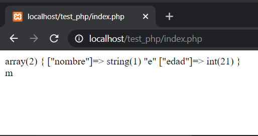<br>


## Funciones de php más usadas  ⚙️

_**isset($var)**_
```php
<?php
/*
    php cuenta con ciertas funciones creadas que nos servirán.
    En este caso usaremos isset($variable), ya que esta nos servirá para saber si alguna variable o constante existe o está definida.
    Usaremos una condición en un pequeño ejemplo
    */
    if(isset($hola)){ // le enviamos una variable, que se haya declarado o no, si no se ha declarado botará un valor de falso sin ningún error.
        echo "existe la variable hola";
    }else{
        echo "No existe la variable hola";
    }

    echo "<br>";
    /*
    Ahora definiremos (o sea la declaramos y le damos un valor) una variable y la enviaremos a la función isset();
    */
    $definido = "hola";
    if(isset($definido)){ // la variable $definido si existe o se ha declaro antes de que se ejecute este código por dende entrará por el if.
        echo "existe la variable definido";
    }else{
        echo "No existe la variable definido";
    }
    /*
    Tomando el ejemplo del arreglo y su problema al intentar imprimir un valor de una posición que no existe, podemos usar isset($arreglo[20]) para saber si exite
    */
    /**Así
    if(isset($arreglo[20])){
        echo $arreglo[20];
        // esto imprimirá cuando exista valor en esa posición
    }
    */
?>
```

Resultado:<br>

<br>
_**is_null($var)**_

_Esta función que nos provee php sirve para saber si una variable tiene el contenido nulo o no, retorna true si la raviable es nula, o sea no posee información, caso contrario retornará false._
```php
<?php
    $var = null;
    if(is_null($var)){
        echo "variable nula";
    }else{
        echo "variable tiene contenido";
    }

    $var = 8451;
    if(is_null($var)){
        echo "variable nula";
    }else{
        echo "variable tiene contenido";
    }
?>
```


Resultado:<br>

<br>

_**count()**_<br>
_Esta función nos ayudará a saber cuál es el tamaño  de un arreglo._
```php
<?php
    $arr = [1,5,9];
    echo count($arr); // imprimirá 3
    // Podremos usarla en conficionales
    /*
    Ejemplo:
        Podemos verificar si el arreglo está vacío o lleno
    */
    if(count($arr)>0){
        // Si el tamaño del arreglo es mayor a 0 quiere decir que tiene mínimo 1 valor
        echo "Tiene valores";
    }else{
        echo "No tiene datos.";
    }
?>
```
## Constantes ⚙️

_Los valores de las constantes nunca van a variar y si intentamos cambiar su valor nos arrojará un error._<br>
_Estas constantes son más usadas para las rutas dentro del patrón MVC (Modelo Vista Controlador)._<br>
_Declaración_

```php
<?php
    /*
        Las constantes se definen de manera diferente a las variables normales.
        Ya que se definen con la función define().
        Esta función recibe dos valores define(valor1, valor2);
        Siendo el valor 1 el nombre de la constante dentro de comillas.
        El valor 2 puede ser cualquiera
    */
    define("CONSTANTE","valor");
    echo CONSTANTE;// AHORA PODEMOS IMPRIMIR SU VALOR USANDO SU NOMBRE SIN NINGÚN SÍMBOLO.
    
?>
```

### Funciones 📦

_Las funciones son usadas para una operación en específico, sea una simple suma de valores, hasta de guardar valores a una base de datos._<br>

_Estas funciones no se ejecutarán hasta que el programador las invoque._
_Declaración:_

```php
<?php
    // así se declara una función en php, muy parecido a javascript, sin embarbo, puede tener un poco más de complejidad al recibir y retornar valores.
    function myFunction(){
        echo "Función ejecutada";
    }
    // el flujo del código sigue sin ningún problema sin ejecutar la función hasta que sea llamada.
    echo "Aún no ejecuto mi función. :v";

    echo "<br>";
    // si quiero que se ejecute pues lo que hago es invocarla
    // se pone el nombre de la función con los paréntesis.
    myFunction()// <- así
?>
```
Resultado:<br>
<br>

_La razón por la cuál imprime primero "Aún no ejecuto mi función. :v" es porque el contenido de la función se llama después y esa es la prueba de que una función no se ejecuta hasta que se invoque._
<br>

**Funciones con pámetros**

_Ahora tenemos las funciones las cuales reciben parámetros, o sea valores, estos sirven para que la función sea genérica y más dinámica, ya que pueden realizar una operación según los valore que recibe la misma._
```php
<?php
    function funParams( $param_1)
    {
        // esta función recibe un parámetro, o sea un valor el cuál no se sabe cuál es.
    }

    // cuándo se va a invocar la función se necesita enviar tantos valores como parámetros tenga la función.
    // ejemplo
    funParams("valor string");
    $var = 23;
    funParams($var);
?>
```
Con esos 2 ejemplos podemos observar que se puede ejecutar cualquier operación enviando los valores, así se puede ahorar mucho código.<br>

Un ejemplo claro sería el de enviar un arreglo y verificar si tiene valores.

```php
<?php
    /*
    Esta función nos servirá para imprimir un mensaje, sólo tendremos que enviarle el arreglo
    */
    function tieneDatos($arr)
    {
        if(count($arr)>0){
            echo "Tiene valores";
        }else{
            echo "no tiene valores";
        }
    }

    $ar_1 = [];
    $ar_3 = [1];
    $ar_2 = [2.57,54];
    $ar_4 = [];
    tieneDatos($ar_1); // imprime ->no tiene valores
    tieneDatos($ar_2); // imprime ->Tiene valores
    tieneDatos($ar_3); // imprime ->Tiene valores
    tieneDatos($ar_4); // imprime ->no tiene valores
    // así no estamos repitiendo el código de la condicional para cada arreglo
?>
```
**Funciones con retorno de datos**

_Podemos realizar operaciones dentro de una función y retornar algún valor referente a los valores, como por ejemplo la suma de números, la presentación de un mensaje personalizado, sin embargo, este retorno de valores no signiica que se vayan a imprimir, sino que obtendremos el valor ya sea para almacenarla en una variable o imprimir su resultado con otra función._

```php
<?php
// función para sacar el promedio de 3 notas
function promedioNotas($nota1, $nota2, $nota3)
{
    // recibimos las 3 notas, ahora realizamos la operación para sacar el promedio
    $suma = $nota1 + $nota2 + $nota3;
    // tenemos la suma de las 3 notas, ahora sólo falta la división para el número de notas.
    $promedio = $suma / 3;
    //listo, ya tenemos el promedio, pero no es suficiente para obtener su valor fuera de la función.
    // Para retornar ese valor usamos return value;
    return $promedio; // con esto estaremos obteniendo el promedio
} 

// crearemos otra función para saber si aprobó o reprobó
// esta función será algo especial ya que igualaremos el parámetro $promedio a 0, esto sirve en caso de que yo no envíe ningún valor, tomará 0, si yo envío otro valor tomará el valor que le envíe
function estadoEstudiante( $promedio = 0)
{
    if($promedio>=7){
        echo "aprobado";
    }else{
        echo "reprobado";
    }
}

// Ahora a usarlas
$nota1 = 5;
$nota2 = 7;
$nota3 = 10;
// ejecutamos la función que retornará el promedio, pero ese valor ahora está suelto
promedioNotas($nota1, $nota2, $nota3);
// para tener el valor de promedio la almacenaremos en una variable
$promedio = promedioNotas($nota1, $nota2, $nota3);
// listo, ahora quiero saber si aprobó o reprobó, llamamos a la función que nos dice eso
estadoEstudiante(); // si ejecutamos la función así el valor del parámetro será 0 ya que así lo asignamos en la función, imprimirá "reprobado"

estadoEstudiante($promedio) ; // si ejecutamos así, el parámetro tomará el valor enviado y si ese valor es >=7 imprimirá "aprobado"
?>
```

### FOREACH 🖇️
_El for each en php es usando para recorrer arreglo dondo los valores direferentes que contiene el arreglo en orden descendente._

_Es decir, si tenemos los valores 1,5,9,7,20, al hacer el recorrido obtendremos un valor por cada recorrido_
* En el primer recorrido obtemdremos en 1
* En el segundo recorrido obtemdremos en 5
* En el tercer recorrido obtemdremos en 9
* ...
```php
<?php
    // tenemos un arreglo con números
    $arr = [1,5,6,7,9];
    /*
    Tenemos nuestro arreglo, ahora toca recorrelo con el for each, el cuál recibe el valor del arreglo y nos da el valor de cada contenido, incluso de su índice
    // siendo $variable el arreglo a recorrer, $key el índice de cada uno y $value el los datos individuales del arreglo.
    foreach ($variable as $key => $value) {
        # code...
    }
    */
    foreach ($arr as $key => $value) {
        echo "<br>";
        echo "índice: $key, valor: $value";
    }
?>
```
Resultado: <br>
<br>

Ahora algo más complejo
```php
<?php
// tenemos ese objeto de personas, ahora quiero saber si alguien es mayor o menor de edad, separando la funcionalidad en una función aparte
$personas = [
    // primera persona
    [
        "nombre"=> "persona 1",
        "edad"=>21
    ],
    //segunda persona
    [
        "nombre" => "persona 2",
        "edad" => 22 
    ],
    //tercera persona
    [
        "nombre" => "persona 3",
        "edad" => 16 
    ]
];
// creamos la función
// recibimos la edad como parámetro
function esMayor($edad)
{
    // comparamos si es >= 18
    if($$edad >= 18){
        return "es mayor de edad";
    }else{
        return "es menor de edad"; 
    }
}
// esta función nos retorna un string, así que podemos imprimirla

// ahora el foreach
foreach ($personas as $key => $persona) {
    // imprimimos
    echo $persona["nombre"] ." " . esMayor($persona["edad"]) . "<br>";
}
?>
```
La explicación está en que en cada recorrido del arreglo, la variable $persona tomará un datos de ese arreglo.
* En el primer recorrido tomará   [
        "nombre"=> "persona 1",
        "edad"=>21
    ]
* Ahora, ya sabemos qué vale persona, para presentar su nombre nomás nos referimos a la variable $persona y el índice con combre $persona["nombre"] y listo, ya tendremos el nombre.
* Para la edad es silimar $persona["edad"] y la enviamos como parámetro en la función, la cuál retornará una cadena de text con el contenido generado según la codición.

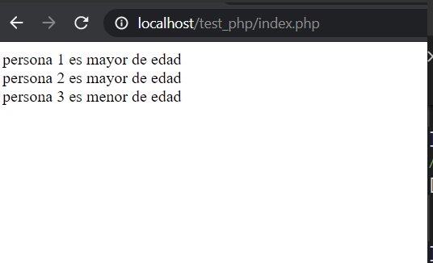<br>

### PHP OO -> php orientado a objetos ⌨️ 🎁 📦

_La programación orientada a objetos es encapsular características por separado que encontraremos en nuestro desarrollo de software._<br>
_Con esta práctica nos servirá para tener más organizado nuestro código_<br>
_Ejemplo_<br>
Tenemos un auto con ciertas carácterísticas y funcionalidades individuales, dicho auto lo podemos representar codificandolo por variables separadas.
```php
<?php
$carro_marca = "TOYOTA";
$carro_color = "azul";
$carro_velcoidad = 156;
$carro_ruedas = 4;
$carro_motor = "v8";
function arranca()
{
    echo "arrancando";
}
function frena()
{
    echo "frenando";
}
function gira($lado)
{
    echo "girando hacia la " . $lado;
}
?>
```
Listo, tenemos sus características y funcionalidades, pero qué pasa si se necesitan más carros, tendríamos que cambiar las variables a un arreglo de datos.

```php
<?php
$carros = [
    [
        "TOYOTA","azul", 156, 4,"v8"
    ],
    [
        "MAZDA","rojo",256,4,"other"
    ]
];

function arranca($carro)
{
    // recibirá 1 valor del arreglo
    echo "arrancando auto marca" . $carro[0];
}
function frena($carro)
{
    echo "frenando";
}
function gira($lado)
{
    echo "girando hacia la " . $lado;
}

arranca($carros[0]); // se envía["TOYOTA","azul", 156, 4,"v8"]

?>
```
Listo, problema resuelto, pero habría que enviar los datos de del arreglo individualmente a cada función por separada, esto no parece problema, peri cuándo la aplicación tiene una mayor funcionalidad se hará más difícil expandir el sistema.

Con la programación orientada a objetos encapsularíamos cada característica del objeto a tratar y sus funcionalidades en una clase, dicha clase es una plantilla con los atributos del objeto, pero los datos los definiríamos cada vez que creamos un objeto.
<br>

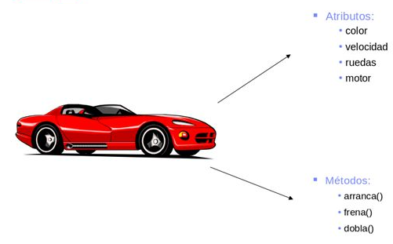
<br>

Entonces definiríamos la clase llamada carro.
```php
<?php
class Carro
{
    
}
?>
```
Listo, ya tenemos la clase carro, ahora falta llenarla con sus atributos y métodos.

```php
<?php
class Carro
{
    // los atributos los definimos como una variable normal, pero estos pueden ser públicos o privados.
    public $marca ;
    public $color ;
    public $velcoidad ;
    public $ruedas ;
    public $motor ;
    // las funciones aquí se denominan métodos.
    public function arranca()
    {
        echo "arrancando";
    }
    public function frena()
    {
        echo "frenando";
    }
    public function gira($lado)
    {
        echo "girando hacia la " . $lado;
    }
}
?>
```
Listo, ya tenemos la plantilla (Clase) para construir cuantos carros quedramos y con las funcionalidades propias.

_Ahora usemos la clase_

```php
<?php
// ya que tenemos la clase ahora tocará construir el objeto
$carro = new Carro();// la manera de obtener ese objeto es instancias con la palabra reservada new seguido del nombre de la clase;
// pero, ¿y los atributos?
?>
```
Al parecer tenemos otro problema, el objeto está creado pero necesitamos darle valor a los atributos, para ello las clases un constructor interno que permite darle valor a cada atributo enviando por parámetro cada valor.<br>
Entonces nuestra clase quedaría así.
```php
<?php
class Carro
{
    // los atributos los definimos como una variable normal, pero estos pueden ser públicos o privados.
    public $marca ;
    public $color ;
    public $velcoidad ;
    public $ruedas ;
    public $motor ;
    // el constructor tiene que ser público, lo definimos con el nombre de __construct
    public function __construct($marca, $color, $velo, $ruedas, $motor){
        // listo, recibimos los valores que serán enviados
        //¿cómo le damos esos valores a nuestros atributos?
        /* existe una palabra reservada para cada objeto que es "this"
        This hace refernecia al objeto en sí pero dentro de la clase, al poner la palabra this podemos llamar cualquier atributo o método interno.
        Ahora queremos llamar al atributo marca
        sería this y marca ya que nos estamos refieriendo al atributo marca de este objeto que se está creando.
        la manera de llamar ese atributo es por medio de la palabra $this seguido de una flecha y el nombre del atributo
        $this->marca => listo
        */
        $this->marca = $marca; // en este caso al valor del atributo marca le damos el valor de la variable marca por que esa variable no tiene ningún this que lo referencia hacia al objeto.
        $this->color = $color ;
        $this->velcoidad = $velo ;
        $this->ruedas = $ruedas ;
        $this->motor = $motor ;
        // listo, ahora si podemos enviar valores a nuestro objeto
    }
    // las funciones aquí se denominan métodos.
    public function arranca()
    {
        echo "Carro de marca $this->marca arrancando";
    }
    public function frena()
    {
        echo "Carro de marca $this->marca frenando";
    }
    public function gira($lado)
    {
        echo "Carro de marca $this->marca girando hacia la " . $lado;
    }
}
?>
```
Listo, ahora probemos.

_Ahora usemos la clase_

```php
<?php
// ya que tenemos la clase ahora tocará construir el objeto
$carroToyota = new Carro("TOYOTA", "ROJO", 125.5, 4,"V8");// enviaremos valores hacia el objeto respetando el orden de cómo se reciben los atributos
// $marca, $color, $velo, $ruedas, $motor 
// ese es el orden en el cual se enviarán los datos

// vamos a crear otro objeto
$carroMazda = new Carro("MAZDA", "AZUL", 156.3, 4,"V10");// 
?>
```
Ahora tenemos dos objetos de tipo Carro, listos para usarlos y ejecutar sus funcionalidades.

```php
<?php
$carroToyota = new Carro("TOYOTA", "ROJO", 125.5, 4,"V8");
// ya tenemos los objetos instanciados listos para usarlos

// ahora arrancaremos con el auto toyota
/*
Para eso tenemos que tener la variable que contiene el objeto y llamar a su funcionalidad por medio de la flecha.
$objeto ->  funcion ($params); enviamos valor a los parámatros en caso de que se requiera
*/
$carroToyota->arranca();
?>
```
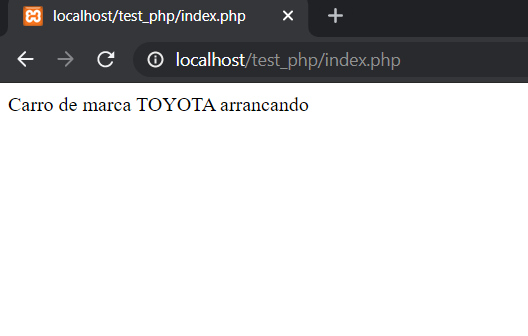<br>
Así podemos llamar a cualquier funcionalidad del objeto.

```php
<?php
$carroToyota = new Carro("TOYOTA", "ROJO", 125.5, 4,"V8");
$carroToyota->arranca();
echo "<br>";
$carroToyota->gira("derecha");
echo "<br>";
$carroToyota->gira("izquierda");
echo "<br>";
$carroToyota->frena();
?>
```
Resultado:<br>
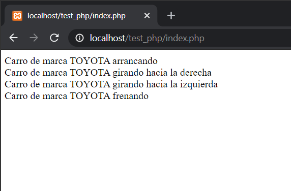


## Ejercicio Final 📄

_Ahora con el ejercicio del auto lo arreglaremos para que tenga más funcionalidades._<br>
* Formar un arreglo de carros con características diferentes.
* Condición: que el auto sólo arranque cuándo está encendido.
* Condición: que el auto se detenga cuádo está en modo arranque y esté encendido.
* Mostrar todas las marcas de autos guardadas en el arreglo.
* Antes de mostrar los carros, pregunte si el arreglo está vacío.

_Creamos un archivo llamado Carro.php_
```php
<?php
class Carro
{
    // los atributos los definimos como una variable normal, pero estos pueden ser públicos o privados.
    public $marca ;
    public $color ;
    public $velcoidad ;
    public $ruedas ;
    public $motor ;
    private $estaEncendido= false; // false: apagado, true: encendido
    private $estaEnArranque= false; // false: arrancando, true: detenido
    // el constructor tiene que ser público, lo definimos con el nombre de __construct
    public function __construct($marca, $color, $velo, $ruedas, $motor){
        $this->marca = $marca; 
        $this->color = $color ;
        $this->velcoidad = $velo ;
        $this->ruedas = $ruedas ;
        $this->motor = $motor ;
        // listo, ahora si podemos enviar valores a nuestro objeto
    }
    // las funciones aquí se denominan métodos.
    public function encender()
    {
        // hacemos condicionales para saber si el carro está encendido, si lo está no tendrá que encenderlo otra vez
        if($this->estaEncendido){
            echo "El carro $this->marca ya está encendido.";
        }else{
            $this->estaEncendido =true; // cambiamos su estado
            $this->estaEnArranque =true;
            echo "Carro de marca $this->marca encendido.";
        }
    }
    public function arranca()
    {
        // sólo arranca cuando el carro está encendido
        if($this->estaEncendido){
            $this->estaEnArranque =true; // cambio de estado
            echo "Carro de marca $this->marca arrancando";
        }else{
            echo "Carro de marca $this->marca no está encendido";
        }
    }
    public function frena()
    {
        // sólo frena cuándo el carro está encendido y está en modo de arranque
        if($this->estaEncendido){
            if($this->estaEnArranque){
                $this->estaEnArranque =false; // cambio de estado
                echo "Carro de marca $this->marca frenando";
            }else{
                echo "Se necesita arrancar con el auto de marca $this->marca";
            }
        }else{
            echo "Carro de marca $this->marca no está encendido";
        }    
    }
    public function gira($lado)
    {
        // sólo gira cuando el carro está encendido
        if($this->estaEncendido){
            echo "Carro de marca $this->marca girando hacia la " . $lado;
        }else{
            echo "Carro de marca $this->marca no está encendido";
        }
    }
    public function apagar( )
    {
        if($this->estaEncendido){
            echo "Carro de marca $this->marca apagado";
            $this->estaEncendido = false;
        }else{
            echo "Carro de marca $this->marca no está encendido";
        }
    }
}
?>
```


Ahora tenemos en index.php otros daros<br>
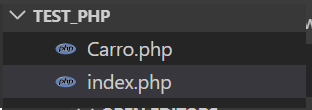<br>


```php
<?php
// usamos esta función que nos provee php para incluir el archivo con la clase Carro y temer e código más organizado.
require_once "Carro.php";

// ahora el arreglo

$carros =[
    new Carro("BMW", "NEGRO",156.2,4,"V8"),
    new Carro("AVEO", "AZUL",196.2,4,"V8"),
    new Carro("KIA", "AZUL",154.5,4,"V8"),
    new Carro("MARZA", "ROJO",253.1,4,"VB"),
    new Carro("TOYOTA", "BLANCO",251,4,"VB"),
];

/*
    Recordemos que instanciabamos un objeto con la palabra reservada new seguido del nombre de la clase y enviando los valore requerido.
    $var = new Carro(...);
    ahora instanciamos cada uno dentro del arreglo sin necesitar ninguna variable, es un modo rápido.
    sólo se ncesita del -> new  Carro(...);
*/

// Recorremos el arreglo e imprimimos la marca y lo mandamos a encender
// pero antes hay que verificar si tiene datos

// usamos la función empty de php para verificar si está vacío
// SI está vacío retorna true, por ende lo negamos para que retorne true si tiene datos
if(!empty($carros)){
    foreach ($carros as $key => $carro) {
        echo "<br>";//salto
        echo "Marca: $carro->marca"; // así como también llamamos a las funcionalidades con la flecha, también podemos llamar a los atributos con la misma, siempre y cuándo sean públicos -> public $var;
        $carro->encender();
    }
}else{
    echo "No hay carros";
}

// listo, ahora podemos probar otra vez intentar encenderlos, pero es mucho código, entonces refactoricemos convirtiendolos en funciones separadas.
?>
```

Resultados:<br>


```php
<?php
// usamos esta función que nos provee php para incluir el archivo con la clase Carro y temer e código más organizado.
require_once "Carro.php";

// ahora el arreglo

$carros =[
    new Carro("BMW", "NEGRO",156.2,4,"V8"),
    new Carro("AVEO", "AZUL",196.2,4,"V8"),
    new Carro("KIA", "AZUL",154.5,4,"V8"),
    new Carro("MARZA", "ROJO",253.1,4,"VB"),
    new Carro("TOYOTA", "BLANCO",251,4,"VB"),
];
// listo
/*
    Ahora haremos una función que reciba el arreglo de carros y haga lo que hacía en el ejemplo anterior.
*/
function encenderCarros( $carros_params)
{
    if(!empty($carros_params)){
        foreach ($carros_params as $key => $carro) {
            echo "<br>";//salto
            echo "Marca: $carro->marca"; // así como también llamamos a las funcionalidades con la flecha, también podemos llamar a los atributos con la misma, siempre y cuándo sean públicos -> public $var;
            $carro->encender();
        }
    }else{
        echo "No hay carros";
    }
}

// ahora probaremos
echo "<br> Envío carros";
encenderCarros($carros);
echo "<br> Vacío";
encenderCarros([]); // se le envía datos vacíos
echo "<br> Envío carros otra vez.";
encenderCarros($carros);
?>
```


_El ejercicio quedará adjunto en este repositorio_
## Autores ✒️

* **Edward Reyes** - *Trabajo Inicial* - [edw-rys](https://github.com/edw-rys)


## ¿tienes Dudas? 🎁

* Sólo responderé a la anfitriona.
* La pregunta tene que ser de php o POO.


---
⌨️ Con aprecio por [edw-rys](https://github.com/edw-rys) :v