# Guía básica de php
## Comenzando 🚀
## Reutilizar plantillas html con php 🚀

_En muchas ocasiones usamos varios documentos HTML y escribimos el mismo código, una prueba de esto son los menús de navegación, con php podemos tener aquello con un archivo separado, simulando componentes para poder usarlos en otros archivos, minimiando código y cuándo haya que hacer un cambio sólo se tendrá que modificar en un sólo archivo_

_Tenemos un ejemplo_
_Supongamos que tengamos un archivo index.php_
```html
<!DOCTYPE html>
<html lang="en">
<head>
    <meta charset="UTF-8">
    <meta name="viewport" content="width=device-width, initial-scale=1.0">
    <title>Document</title>
</head>
<body>
    <header>
        <a href="index.php">Logo</a>
        <nav>
            <ul>
                <li><a href="index.php">Index</a></li>
                <li><a href="contact.php">Contacto</a></li>
                <li><a href="rutine.php">Rutina</a></li>
            </ul>
        </nav>
    </header>
    <main>
        Contenido de index
    </main>
    <footer>
        <ul>
            <li><i>Icon</i></li>
            <li><i>Icon</i></li>
            <li><i>Icon</i></li>
        </ul>
    </footer>
</body>
</html>
```

_Ahora un archivo de contact.php_
```html
<!DOCTYPE html>
<html lang="en">
<head>
    <meta charset="UTF-8">
    <meta name="viewport" content="width=device-width, initial-scale=1.0">
    <title>Document</title>
</head>
<body>
    <header>
        <a href="index.php">Logo</a>
        <nav>
            <ul>
                <li><a href="index.php">Index</a></li>
                <li><a href="contact.php">Contacto</a></li>
                <li><a href="rutine.php">Rutina</a></li>
            </ul>
        </nav>
    </header>
    <main>
        Contenido de contact
    </main>
    <footer>
        <ul>
            <li><i>Icon</i></li>
            <li><i>Icon</i></li>
            <li><i>Icon</i></li>
        </ul>
    </footer>
</body>
</html>
```

_No hay mucha diferencia, sólo el contenido del main, por ende es mejor separar las partes que se repiten en archivos php separados, las cuales serán plantillas._

Creamos un nuevo directorio en c:/xampp/htdocs llamado test_form y luego lo abrimos con visual studio code

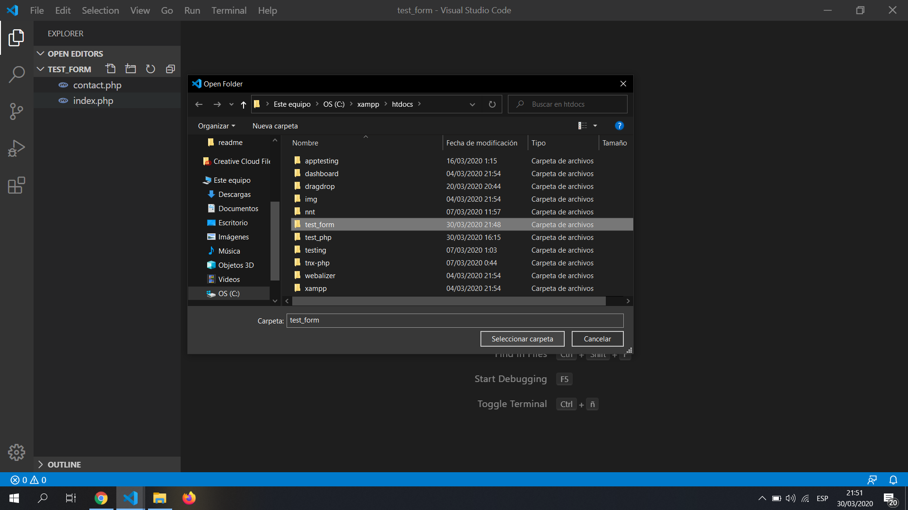<br>

Ahora crearemos el archivo index.php y contact.php.<br>
Crearemos un directorio separado para las plantillas y dentro de aquellas crearemos los archivos header.php y footer.php.
<br> 

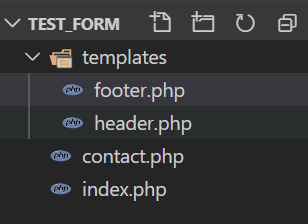<br>
Ahora en header.php pondremos la parte superior del código anterior.<br>
header.php
```html
<!DOCTYPE html>
<html lang="en">
<head>
    <meta charset="UTF-8">
    <meta name="viewport" content="width=device-width, initial-scale=1.0">
    <title>Document</title>
</head>
<body>
    <header>
        <a href="index.php">Logo</a>
        <nav>
            <ul>
                <li><a href="index.php">Index</a></li>
                <li><a href="contact.php">Contacto</a></li>
                <li><a href="rutine.php">Rutina</a></li>
            </ul>
        </nav>
    </header>
```
En el archivo de footer.php pondremos la parte inferior.
```html
    <footer>
        <ul>
            <li><i>Icon</i></li>
            <li><i>Icon</i></li>
            <li><i>Icon</i></li>
        </ul>
    </footer>
</body>
</html>
```
_listo, ahora podremos reutilizar ese código incluyéndolo en los cada archivo plantilla html que se cree._<br>
_Usaremos una función de php que permite incluir un archiv externo:._
* include "url". Esta función incluye un archivo php sin importar que ya haya sido usado.
* include_once "url". Esta función incluye una vez el archivo, si intentamos incluir el mismo archivo con esta función no la incluirá.<br>

_Recordemos que estas funciones tienen que ejecutar entre equitetas de php._<br>
index.php

```html
<!-- Abrimos las etiquetas de php -->
<?php
    // llamamos a la función.
    // Ahora tendremos que acudir a la ruta en donde se encuentra el archivo header .php
    include_once "templates/header.php"; 
 // cerramos la etiqueta
?>

<!-- Ahora podremos poner el contenido propio de este archivo -->
<main>
    Contenido de index
</main>
<?php
// lo mismo que hicimos con header.php haremos con footer.php
    include_once "templates/footer.php"; 
?>
```
Rutas:<br>
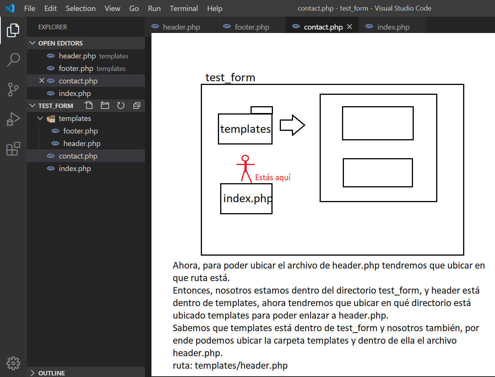<br>
Abriremos el navegador y ponemos el link: http://locahost/test_form<br>
El servidor en si buscará algún archivo index con extensión html o php cuando no indicamos el archivo, es decir sería similar a poner http://locahost/test_form/index.php.<br>
Resultado: <br>
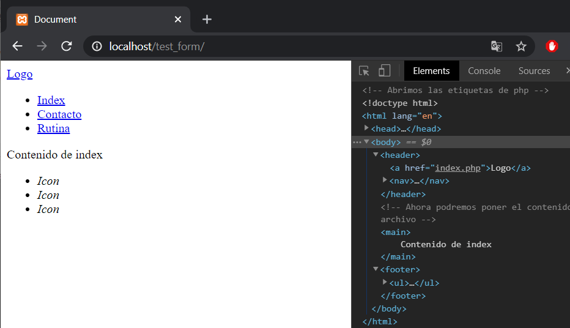<br>
Observaremos que tendremos el mismo resultado pero con menos código.
Lo mismo haremos para contact.php
```html
<?php
    include_once "templates/header.php"; 
?>
<!-- Ahora podremos poner el contenido propio de este archivo -->
<main>
    Contenido de contact
</main>
<?php
    include_once "templates/footer.php"; 
?>
<?>
```
Resultado: <br>
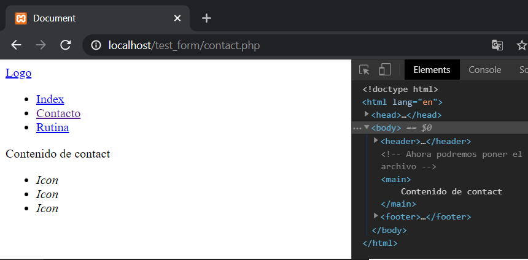<br>

También podremos darle nombre al título de la página enviando el nombre por medio de una variable en cada archivo, primero modificaremos header.php, también le añadiremos los estilos de bootstrap.

<br><br>

header.php
```html
<!DOCTYPE html>
<html lang="en">
<head>
    <meta charset="UTF-8">
    <meta name="viewport" content="width=device-width, initial-scale=1.0">
    <title>
        <?php
        echo $title;
        ?>
    </title>
    <!-- Permite añadir estilos externos -->
    <link rel="stylesheet" href="https://stackpath.bootstrapcdn.com/bootstrap/4.4.1/css/bootstrap.min.css">
    
</head>
<body>
    <header>
        <nav class="navbar navbar-expand-lg navbar-light bg-light">
            <a class="navbar-brand" href="index.php">Logo</a>
            <div class="collapse navbar-collapse" id="navbarNav">
                <ul class="navbar-nav">
                    <li class="nav-item active"><a class="nav-link" href="index.php">Index</a></li>
                    <li class="nav-item active"><a class="nav-link" href="contact.php">Contacto</a></li>
                    <li class="nav-item active"><a class="nav-link" href="form.php">form</a></li>
                </ul>
            </div>
        </nav>
    </header>

```

Ahora en cada archivo le enviaremos el titulo con el nombre de esa variable $title.<br>
Lo mismo hacemos con contact.php
```html
<?php
    $title = "index";
    include_once "templates/header.php"; 
?>
<!-- Ahora podremos poner el contenido propio de este archivo -->
<main>
    Contenido de index
</main>
<?php
    include_once "templates/footer.php"; 
?>
<?>
```
<br>

### Formularios 📋

_El uso de formularios es primordial en una aplicación web._

_Estos formularios estarán hechos en html, sin embargo, se enviarán los datos hacia un servidor el cuál podrá procesarlos para guardarlos, editarlo, etc._<br>
Crearemos un archivo llamado form.php, añadiremos un formulario con estilos definidos que nos provee bootstrap (sólo para diseño).

```html
<?php
include_once "templates/header.php";
?>
<main style="width:300px; margin:auto">
    <form action="datos.php" method="POST">
        <div class="form-group">
            <label for="email">email: </label>
            <input type="email" class="form-control" id="email" name="email">
        </div>
        <div class="form-group">
            <label for="psw">Password</label>
            <input type="password" class="form-control" id="psw" name="password">
        </div>
        <div class="form-group form-check">
            <input type="checkbox" class="form-check-input" id="check" name="check">
            <label class="form-check-label" for="check">Check me out</label>
        </div>
        <div class="form-check">
            <input class="form-check-input" type="radio" name="genero" id="rd_male" value="male">
            <label class="form-check-label" for="rd_male">
                Masculino
            </label>
        </div>
        <div class="form-check">
        <input class="form-check-input" type="radio" name="genero" id="rd_female" value="female">
            <label class="form-check-label" for="rd_female">
                Femenino
            </label>
        </div>
        <button type="submit" class="btn btn-primary">Submit</button>
    </form>
</main>
<?php
include_once "templates/footer.php";
?>
```
En este archivo las etiquetas más importantes son las de form e input.<br>
La etiqueta form tiene dos atributos importantes que son la de action y la de method.
* action: Inidca la ruta a la cuál van a ir dirigidos los datos del formulario.
* method: indica el método por el cúal se enviarán los datos, los más usados son GET y POST
    * GET: envía los datos por la url, ejemplo: http://localhost/site/datos.php?dato1=datos?dato2=dato
    * POST: envía los datos en el cuerpo del archivo y no se mostrarán en la url-> http:localhos/site/datos.php

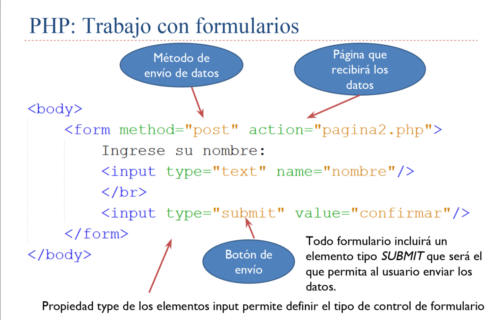<br>
Ahora, para action la enviaremos hacia otro archivo llamado datos.php.<br>
El método que usaremos será POST, ya que estos datos no se deben mostrar en la url.<br>


Los campos input tienen dos atributos importantes.
* name: indica el nombre con el cuál podremos consultarlo desde el archivo que reciba los datos.
* value: es el valor que se obtendrá, por lo general no se los pone en los campos de textos ya que estos se crean al ingresar datos, sin embargo, hay inputs que si lo requieren como el de un checkbox o un radio.

<br>

## Recibiendo los datos
Datos por enviados por get
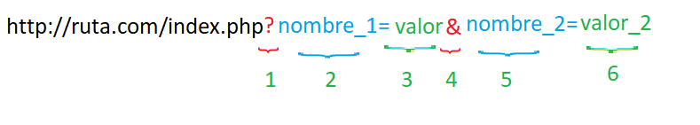<br>
* 1: Identifica que va a ver campos con sus respetivos datos datos.
* 2: El nombre de un campo enviado por get.
* 3: Es el valor del primer campo que se envió por la ruta.
* 4: Caracter de concatenación, para indicar que hay más campos en la url.
* 5: Segundo campo.
* 6: Es el valor del segundo campo que se envió por la ruta.

_Ahora en datos.php mostraremos los datos enviados por el usuario_<br>
Para ello usaremos variables superglobales que proporciona php, estas son:
* $_GET: obtener todos los valores que son enviados mediante la url.
* $_POST: obtener sólo los datos enviados por el cuerpo del archivo, no de la url.
* $_REQUEST: recibe los datos que son enviados por post y por get.
```php
<?php
// ahora usaremos la variable superglobal $_REQUEST para obtener los valores, también podremos usar $_POST
// como estas variables son un arrego de datos con un índice con nombre, podremos acceder a ellas por medio de su índice indicando el nombre que fue indicado en la etiqueta input de html.
//<input name="nombre">, entonces tendríamos $_REQUEST["nombre"] 
// le hemos enviado-> email, password, check y genero. 
echo $_REQUEST["email"];
echo "<br>";
echo $_REQUEST["password"];
echo "<br>";
echo $_REQUEST["check"];
echo "<br>";
echo $_REQUEST["genero"];
?>
```
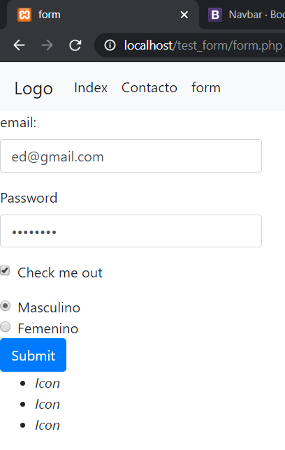<br>
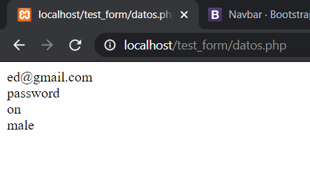

Ahora, si no enviamos marcados algunos campos, estos no se enviarán y por ende darían errores.<br>
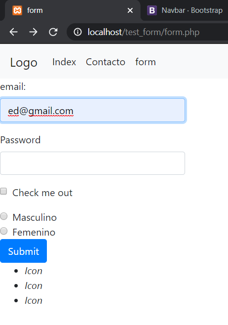<br>
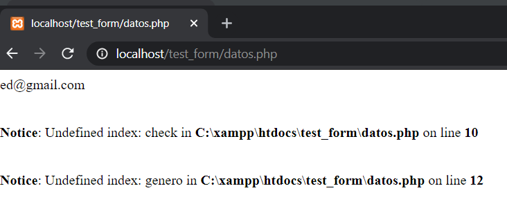<br>
Entonces se debe preguntar si esos valores existen o están vacíos, usaremos las funciones isset() y empty(), para saber si existen o están vacíos los campos.
```php
<?php
// usamos isset para saber si existe el campo y luego preguntamos si ese campo tiene algún valor ingresado
// la lógica que se maneja es comprobar si los datos son correctos imprime el dato, sino imprime algún valor avisando el error
if(isset($_REQUEST["email"]) && !empty($_REQUEST["email"])){
    echo $_REQUEST["email"];
} else{
    echo "No ingresó correo";
}
echo "<br>";
if(isset($_REQUEST["password"]) && !empty($_REQUEST["password"])){
    echo $_REQUEST["password"];
}else{
    echo "No ingresó contraseña";
}
echo "<br>";
if(isset($_REQUEST["check"])){
    echo $_REQUEST["check"];
} else{
    echo "Opción check descartada";
}
echo "<br>";
if(isset($_REQUEST["genero"])){
    echo $_REQUEST["genero"];
}else{
    echo "No se ha seleccionado gpenero";
} 
?>
```
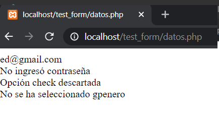

## SESIONES ⚙️
_Las sesiones nos sirven para almacenar datos y poder visualizar esos datos en otras páginas, al momento de recargar la página en el navegador las variables se pierden y por ende también los datos, las sesiones nos ayudan a tener la persistencia de esos datos._<br>
_Declaración:_
```php
<?php
    // iniciar sesión
    // tenemos que ejecutar la función para iniciar sesión para que la variable superglobar de sesión esté disponible, en caso de que esta función se ejecute, la variable $_SESSION no existirán en el código.
    session_start();

    $_SESSION["nombre"]="name"; // usamos la variable superglobal $_SESSION y ubicamos el nuevo índice para guardar un valor
    // podemos guardar varios valores en la variable superglobal $_SESSION, ya que esta es un arreglo
    // tendremos que darle el nombre del índice y su valor, así mismo podremos imprimirlo
    $_SESSION["num"]=23;
    echo $_SESSION["num"];
    // ahora que han sido guardadas se podrá acceder a ellas desde otra página.
?>
```
Otra página
```php
<?php
    session_start();
    echo $_SESSION["num"]; // imprimirá el valor que haya sido guardado.

    // para eliminar un valor de la sesión lo podremos hacer con la función unset
    unset($_SESSION["num"]);

    // Listo, ahora $_SESSION["num"] ya no existe, sólo $_SESSION["nombre"]

    // para borrar todos los datos de la sesión se usa la función session_destroy();
    session_destroy();
    //Esto eliminará todos los valores almacenados en la sesión.
?>
```

_Probemos con un ejemplo_<br>
Usando el mismo formulario del archivo form.php, modificaremos el archivo data.php para que este nos redireccione a una página de presentación de los datos, siempre y cuándo estos sean correctos.

```php
<?php
// Ya tenemos las condicionales, ahora necesitaremos una bandera para indicar si los datos están correctos.
$correcto= true; // iniciará en verdadero, cuando un dato esté mal lo cambiará a false
if(isset($_REQUEST["email"]) && !empty($_REQUEST["email"])){
    echo $_REQUEST["email"];
} else{
    echo "No ingresó correo";
    $correcto= false;
}
echo "<br>";
if(isset($_REQUEST["password"]) && !empty($_REQUEST["password"])){
    echo $_REQUEST["password"];
}else{
    echo "No ingresó contraseña";
    $correcto= false;
}
echo "<br>";
// el valor de check es opcional, lo almacenaremos en una variable
$check ="No check";
if(isset($_REQUEST["check"])){
    echo $_REQUEST["check"];
    $check = $_REQUEST["check"];
} else{
    echo "Opción check descartada";
}
echo "<br>";
if(isset($_REQUEST["genero"])){
    echo $_REQUEST["genero"];
}else{
    echo "No se ha seleccionado gpenero";
    $correcto= false;
} 

// ahora que tendremos la bandera que nos indica que los datos están correctos, haremos una condicional con dos fines

// usaremos una función de php para redireccionar a otra pestaña, se llama header, recibe un string con ciertos valores, pero por ahora usaremos el de Location

if($correcto){
    session_start();
    // guardaremos los valores en las sesiones
    $_SESSION["check"] = $check;
    $_SESSION["password"] = $_REQUEST["password"];
    $_SESSION["check"] = $_REQUEST["genero"];
    $_SESSION["email"] = $_REQUEST["email"];
    // ahora ya están listas
    //redireccionaremos a otra página para presentar los datos
    header("Location:show.php");
}else{
    // si los datos son incorrectos redireccionaremos a la página de form.php
    header("Location:form.php");
}
?>
```

creamos un archivo llamado show.php en el directorio actual "test_form".
```html
<?php
    // ejecutamos la función de session start
    session_start();
    $title = "contact";
    include_once "templates/header.php"; 

?>

<!-- Ahora podremos poner el contenido propio de este archivo -->
<main>
    <!-- Presentamos los datos -->
    <p>
        <span>Email: </span>
        <span><?php echo $_SESSION["email"]?></span>
    </p>
    <p>
        <span>Password: </span>
        <span><?php echo $_SESSION["password"]?></span>
    </p>
    <p>
        <span>check: </span>
        <span><?php echo $_SESSION["check"]?></span>
    </p>
    <p>
        <span>genero: </span>
        <span><?php echo $_SESSION["genero"]?></span>
    </p>
</main>
<?php
    // por último eliminaremos la sessión
    // session_destroy(); // al momento de hacer esto ya no estarán disponibles los datos, no es remomendable hacerlo
    include_once "templates/footer.php"; 
?>
```
Resultado:<br>
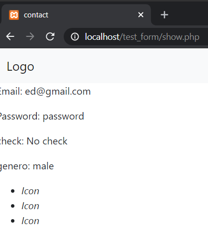

## COOKIES
_Las cookies son similares a las sesiones, con la diferencia que las cookies sólo pueden almacenar texto plano y las sessiones podrán almacenar hasta objetos, las cookies tienen un tiempo de expiración._
```php
<?php
// para guardar una cookie se usa la función setcookie
// * el primer valor es el nombre de la cookie
// * el segundo es el valor de esa cookie
// * el cuarto es el nombre de la cookie, le indicamos con la función time más el tiempo dispoble, ponemos la función time() y luego le sumamos un valor en segnundos
setcookie("nombre","valor",time() +3600);
// La imprimimos usando la variable superglobal cookie
echo $_COOKIE["nombre"];
?>
```
La function setcookie() de PHP genera y envía la cookie al navegador y devuelve un boleano, si es true indica que se pudo incluir en el navegador del usuario y si es false indica que no ha podido colocarla en el sistema. Pero este valor no indica que luego el visitante la haya aceptado o no, puesto que el navegador puede haberlo configurado para no aceptar cookies y esto no lo puede detectar setcookie() directamente.
<br>
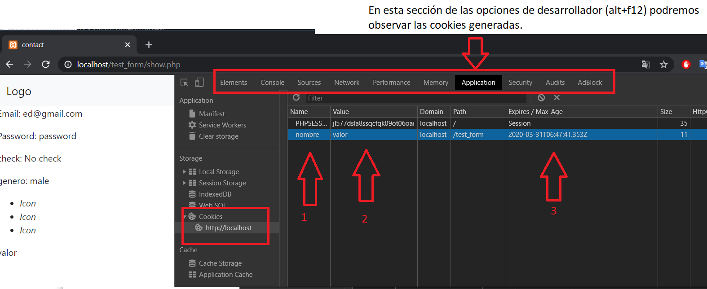<br>
* 1: El nombre de las cookies guardadas.
* 2: valor de la cookie.
* 3: tiempo de expiración de las cookies