# MVC (Model View Controller - Modelo Vista Controlador)

## ¿Qué es?

_Es un patrón de arquitectura de software la cual separa la aplicación en tres capas:_<br>

* Capa de Modelo.- Manejo de datos.
* Controlador.- Lógica de negocio
* Vista.- Presentación de los datos.<br>


## Problemática que resuelve

_En las aplicaciones, las cuales deben manejar gran cantidad de módulos, los cuales podrían ser independientes o dependientes de otros, sería muy complejo controlar cada uno de los módulos si la aplicación se centrara en tener el código de la estructura de la vista (formularios, presentación de datos, etc.), la lógica con la cuál se manejan los datos y la lógica de almacenamiento y consulta de datos en un sólo archivo._
<br>
_A todo esto la solución sería separar cada módulo y a la lógica de programación (tratamiento de datos), presentación y almacenamiento de datos._
<br>
_Pero para ello tendremos que basarnos en la arquitectura MVC (Model View Controller), que será explicado en el siguiente escenario:._

**1. Supongamos que un usuario intenta acceder al siguiente link desde un navegador:**<br>
_https://beautifull-cat.com/_<br>

<center><br></center>

**2. Ahora el navegador se denominará "CIENTE", el cuál hace una petición al servidor por medio de ese link.**<br>
**3. El servidor recibirá esa petición hecha por el cliente, luego interactuará con la arquitectura MVC.**

## Lógica del controlador

**4. La petición hecha llegará directo al controlador, a al que se haya indicado, esto se podrá definir de diferentes maneras, por ejemplo:**<br>
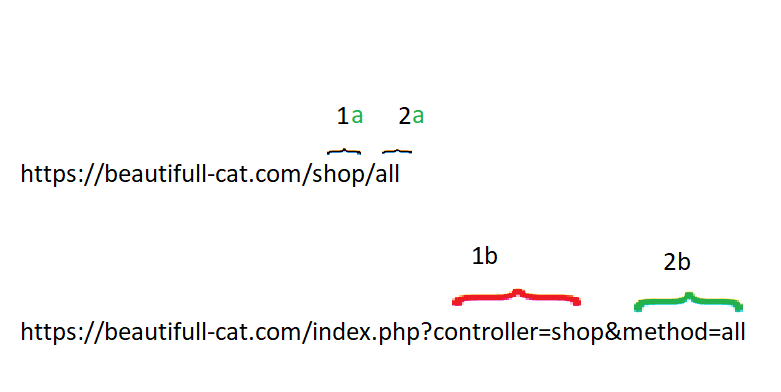
<br>
En la imágen tenemos dos url algo direfentes, pero eso se define en la lógica de programación de cómo se va a hacer el control de la url y el llamado de métodos.
<br>
_Url -> a_<br>
_Observaremos una url normal, pero nosotros tomaremos en cuenta de lo que irá después del ".com/", ya que según los siguientes campos se hará la llamada a algún controlador y se ejecutará un método del mismo._
* 1a. En el primer campo el cuál se llama en la url va a cambiar según se requiera un controlador (Es decir, este campo es el cuál llamará al controlador, en caso de que haya un controlador para usuario, otro para las ventas, se tendrá que saber a que controlador llamar y ese campo lo indicará).
* 2a. Ya que sabemos a qué controlador entraremos, debemos saber qué acción realizar dentro del mismo, ya que hará uno para agregar, otro para consusltar, etc., y dependemos de este campo el cuál nos indicará qué acción realizar.

<br>

_Url ->b_<br>

_En esta url vemos algo diferentes, en primer lugar se observa que no es una url nada amigable, ya que lleva parámetros, pero esta url se puede observar compleja de tratar, pero es más fácil de adaptar al momento de obtener los datos, ya que son parámetros enviados por GET -> **controlador=shop** y **method=all**_

* 1b.- En esto vemos un campo enviado por get llamado controller, y el valor nos indicará el controlador a invocar.
* 2b.- En esto vemos el campo method que también es enviado por get, nos indicará el método a ejecutar del controlador que fue indicado.
<br>
<hr>
**Ejemplo**<br>

_Supongamos que tenemos desarrollado un sistema el cual dispondrá de cuatro controladores, los cuales tendrá el control de cada acción disponibleen el sistema:_<br>

* GatoController.- Este controlador contiene métodos para agregar, eliminar, editar o consultar gatos y sus razas.
* ShoptController.- Este controlador dispone de dos métodos, estos se encargarán de mostrar diferentes mascotas y su venta.
* UserController.- Este controlador se encargará de las funciones de iniciar sesión, cerrar sesión, etc.
* ProductosController.- Control de productos.

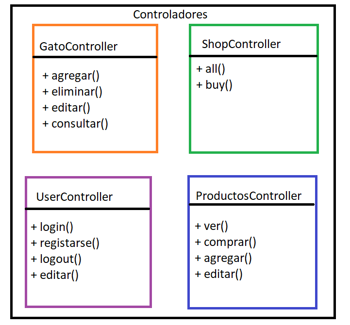<br>
_Ahora que están listos, podremos usarlos y la manera de hacerlo en la web es por medio de una url, la url que nos indica el dominio nunca va a cambiar -> https://beautifull-cat.com/, pero los argumentos a enviar si._<br>
Tendremos dos escenarios:<br>
**1 => https://beautifull-cat.com/shop/all** <br>
En esta url hacemos un llamado a shop, es decir, de todos los controladores que tenemos nos centraremos sólo en el de Shop Controller, listos, ahora se sabe a que controlador instanciar, pero no a qué método, para eso está el segundo valor, el cuál es all, y por medio de la lógica de programación se invocará a ese método y listo, ahora sabremos como se invoca un controlador.

<br>
**2 => https://beautifull-cat.com/index.php?controller=gato&method=agregar**<br>
Aquí no habrá mucha diferencia.<br>
Tenemos el archivo llamado index.php, el cual recibe dos parámetros (controller y methos), y ya sabemos como va, el valor de controller llamará al controlador y el valor de methos invocará al método.
<br>
<br>
El resultado será así:
<br>
<br>
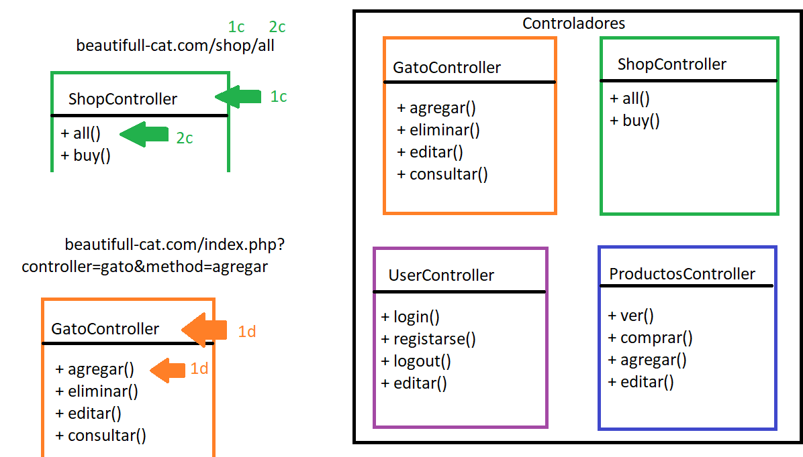
<br>

* 1c. Se indica el controlador a invocar de la lista de controladores disponible.
* 2c. Se indica el método a invocar dentro del controlador al que se instancia.

Para los de "d" es la misma lógica, sólo que los valores serán tomados de los parámetros controller y method enviados por get.
<hr>

_**Nota: habrá ciertas url las cuales sólo tendrán hasta la dirección hasta ".com" y no habrá campos que indiquen al controlador y el método que se ejecutará, esto se debe a que se ha implementado una lógica de programació, la cuál verificará si exiten los campos, caso contrario se asignará algún controlador o método por defecto:.**_<br>

En la url
**https://beautifull-cat.com/** 
podemos observar que no existe ningún texto después del ".com/" que indique el controlador o método a ejecutar, entonces se tendrá que definir en la lógica de programación a qué controlador y qué método ejecutar, es decir, ya que no existen los nombres del controlador en la URL, se definirá que se invoque al controlador llamado "GatosControlller", la cuál será una clase, y ya que el método no existe, se ejecutará uno por defecto, entonces le indicamos que el método se llamará index, listo.
<hr>

_Ahora que se sabe a qué controlador se instanciará y cuál sera el método a invocar se puede saber qué procesos va a hacer dicho método._<br>
<center>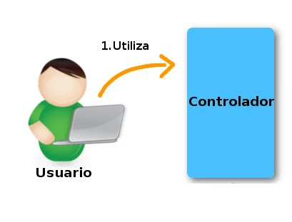</center>
<br>

**5. Ahora, ese controlador lo siguiente que hará es llamar al modelo (Model of MVC) que será del mismo módulo que el controlador.**
<center></center><br>

_Cada controlador llamará a un respectivo modelo, o en caso de ser nacesario podrá invocar a otro modelo._
<br>
Listo, ahora supongamos que se quiere mostrar todos los gatos que se han registrado, el controlador recibe esa orden, este mismo invoca al modelo de dato, el cuál se encarga de manejar la lógica con la base de datos, ya sea para guardar, eliminar, consultar o editar los datos, el controlador invoca un método de ese modelo, en este caso el de "query", obtendrá todos los datos almacenados, el modelo terminó su trabajo, pero el controlador todavía no finaliza.<br>
El controlador tiene los datos, ahora este mismo podrá hacerle algunas modificaciones, como la limpieza de datos, condicionar si hubo datos o el modelo no devolvió nada, según eso puede hacer varias cosas, como preparar un mensaje de "Datos no encontrados" o "error interno", en caso de tener los datos simplemente los tiene listo para poder pintarlos.
<br>
<center>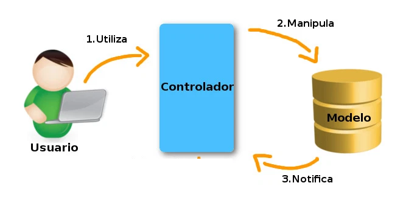</center>
<br>
**6. Entonces, ya obtenido los datos y limpios no queda nada más que pintarlos en una plantilla HTML, pero controlador no se encarga de eso, él llama a una vista (View of MVC).**<br>

_La vista es la que se encarga de presentar los datos en una plantilla HTML al cliente._<br>

Los datos que tiene el controlador los envía a la vista:<br>
<center>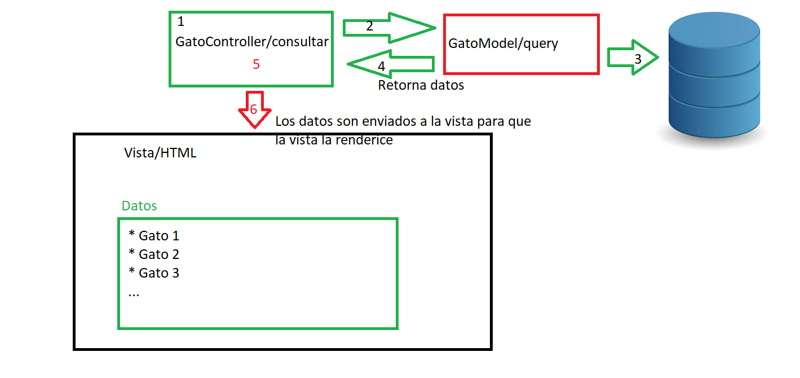</center>
<br>
Listo, ahora esa vista en HTML con los datos pintados será devuelto al cliente (Navegador).
<br><center>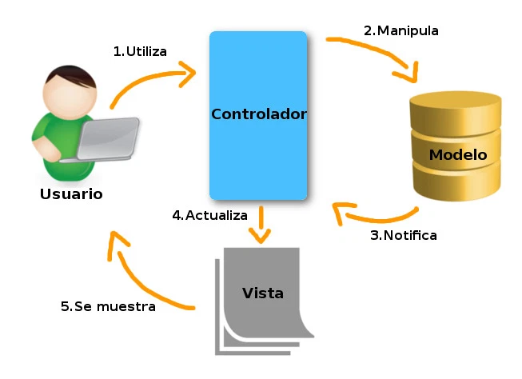</center><br>

_Repaso: MVC es una arquitectura, en la cuál nos podemos basar como estandar para desarrollar sistemas complejos, separar módulos y la lógica de cada uno de ellos._<br>

**Resumen**
* Usuario envía peticiones al controlador (LAS PETICIONES LLEGAN AL CONTROLADOR). 
* El controlador  se encarga de solicitar o enviar datos al modelo y pasárselos a la vista.
* El modelo realiza el trabajo con los datos (comúnmente conectándose a una base de datos), realiza consultas, inserciones, actualizaciones, etc.
* La vista se encarga de la presentación de los datos.

<br><center>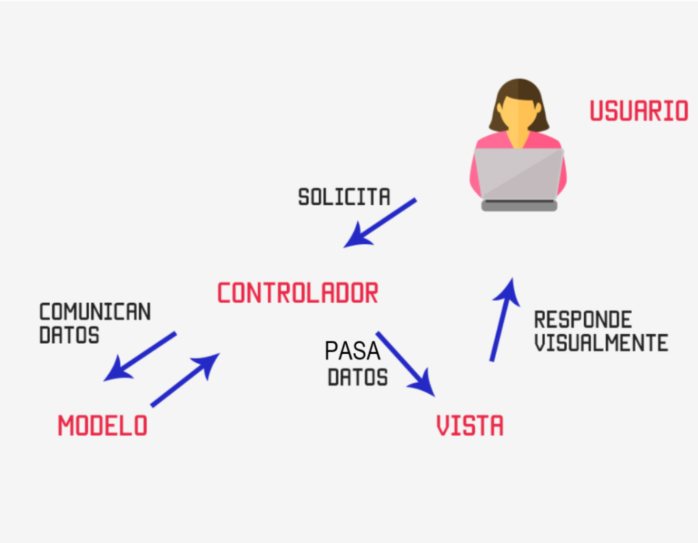</center><br>

**Capa Modelo**<br>
Model (Business process layer)
* Representa los datos, lógica de acceso y manejo de datos.

* Responsable por:
    * Representación de los datos
    * Desempeñar consultas en la base de datos
    * Actualizaciones, inserciones, consultas, búsquedas, etc..

**Capa Vista**<br>

View (Presentation layer)

* Mostrar información de acuerdo al tipo de clientes. (manejo de perfiles)

* Son la representación visual de los datos.
* Ni el modelo ni el controlador se preocupan de cómo se verán los datos, esa responsabilidad es únicamente de la vista.

**Capa Controlador**<br>

* Controller (Control layer)

* Conexión entre el modelo y la vista.

* Recibe peticiones del usuario y se encarga de solicitar los datos al modelo y de comunicárselos a la vista. 

* Contiene la lógica del flujo de ventanas– es decir cual es la siguiente vista que debe ser mostrada.

## MVC y PHP

**Estructura del proyecto**<br>
_Ahora que se sabe cómo funciona el modelo MVC se debe definir la estructura de un proyecto para un sistema._

_Tenemos que tener en cuenta la siguiente:_

* 1. El archivo principal **index** el cuál será invocado y será el que se encargue del enrutamiento, o llamar al controlador que se pida según la ruta.
* 2. Estructura de carpetas, las principales son:
    * Controladores: todos los controladores de los módulos que necesite el sistema.
    * Modelos: todos los modelos que pueden ser invocados por controladores.
    * Vistas: plantillas html para representar los datos.

Listo, ahora ya tenemos las carpetas principales y el archivo principal **index.php**.

Hay que tener en cuenta que habrá archivos estáticos como los estilos, imágenes, archivos de javascript, entre otros, para ellos también habrá un directorio llamado **assets**.

Tenemos:<br>

* 📦 [assets]
* 📦 [controllers]
* 📦 [models]
* 📦 [views]
* 📄 index.php

Pero el archivo de index sólo se encargará de llamar a un archivo el cuál será el que se encargue del control de los parámetros envidos en la ruta ->https://beautifull-cat.com/index.php?controller=gato&method=all

Entonces tendremos que definir ese archivo dentro de otro directorio aparte.

Entonces lo tendremos en uno llamado Classes.

* 📦 [assets]
* 📦 [classes]
* 📦 [controllers]
* 📦 [models]
* 📦 [views]
* 📄 index.php

Ahora podemos tener otros archivos que puedan servir de plantilla para otros en ese directorio como el archivo que tendrá la conexión con la base de datos.

Debemos tener en cuenta que aquellos archivos deben importar a otros para poder usarlos, entonces, estar incluyendo las rutas completas cada vez que los necesitemos puede ser algo molestoso, para ello podremos ubicar dichas rutas en un sólo archivo definiéndolos como constantes, es decir, una contante llamada CONTROLLER la cuál tenga como valor la ruta del directorio controller, así sólo se tendría que incluir la ruta por medio de la constante.
```php
<?php
// Ejemplo
define('CONTROLLER', './ruta/controllers/')
include_once CONTROLLER."controlador.php";
```

Entonces dicho archivo sólo contendrá constantes declaradas que usaremos a lo largo del proyecto, ese archivo será de configuraciones.<br>

Entonces tendremos:

* 📦 [assets]
* 📦 [classes]
* 📦 [config]  -> 📄 config.php
* 📦 [controllers]
* 📦 [models]
* 📦 [views]
* 📄 index.php

Ordenemos un poco los directorios.

* 📦 [app] ->
    * 📦 [classes] -> 
        * 📄 router.php
        * 📄 DB.php
    * 📦 [config] ->
        * 📄 config.php
    * 📦 [controllers]
    * 📦 [models]
* 📦 [assets] ->
    * 📦 [img]
    * 📦 [css]
    * 📦 [js]
* 📦 [views]
* 📄 index.php

Listo, ahora ya tenemos organizado la estructura, ahora definimos los archivos más importantes que son:

* config.php -> rutas de los directorios y archivos, valores de las bases de datos, entre otros.
* index.php -> Llamada a router.
* router.php -> Lectura de los parámetros controller -> c y method -> m que son enviados en la url.
* DB.php -> Control de la base de datos.

_Se debe crear dichos directorios y archivos dentro de una carpeta llamada mvc dentro de htdocs para poder ejecutarla con php._
* 📦 MVC
    * 📦 [app] ->
        * 📦 [classes] -> 
            * 📄 router.php
            * 📄 DB.php
        * 📦 [config] ->
            * 📄 config.php
        * 📦 [controllers]
        * 📦 [models]
    * 📦 [assets] ->
        * 📦 [img]
        * 📦 [css]
        * 📦 [js]
    * 📦 [views]
    * 📄 index.php

## Empecemos

**config.php* 

_Empezaremos con el control de rutas de directorios y archivos, pero para eso tendremos que saber cuál es la ruta raíz del archivo, es decir desde el disco principal del equipo hasta la carpeta, del proyecto, es decir, queremos la ruta "c:/xampp/htdocs/mvc/" en la versión local, la podríamos poner así, pero esa ruta puede cambiar, por lo que sería una molestia cambiar la ruta cada vez que lo cambiamos de directorio o lo montamos en un servidor, para eso php nos proporciona una función, con ella podremos saber el directorio principal.
```php
<?php

// Dicha función es getcwd()
// También definimos una constante llamada DS, que servirá para guardar el caracter separados de directorios, lo obtendemos de la constante DIRECTORY_SEPARATOR que ya existe en php
define('DS'                 , DIRECTORY_SEPARATOR);
// Luego definimos la constante ROOT con el directorio y le concatenamos el separados
define('ROOT'               , getcwd().DS);

// Podremos imprimir los valores para saber que contienen
echo DS .  "   <br>  ".ROOT;
```

_Procedemos a encender apache en Xampp Control_<br>
_Ubicamos la ruta http://localhost/mvc/app/config/config.php en el navegador para ver los cambios_

<center>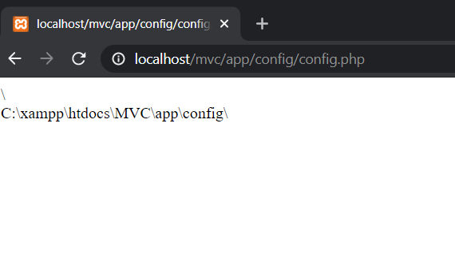</center>

_En la primera linea vemos el separador y en la segunda la ruta._

_Debemos tener en cuenta que esa ruta se llama de acuerdo al criterio que invoquemos en la url, nosotros siempre estaremos llamando a index.php, por ende siempre imprimirá hasta MVC\ ._<br>
Sabiendo esto, todas las rutas de archivos las llamaremos desde el archivo principal, es decir, si queremos acceder a algún modelo, siempre lo buscaremos desde la ruta raíz del proyecto, en este caso la carpeta MVC.

_Ejemplo: accedemos al archivo model1.php_<br>

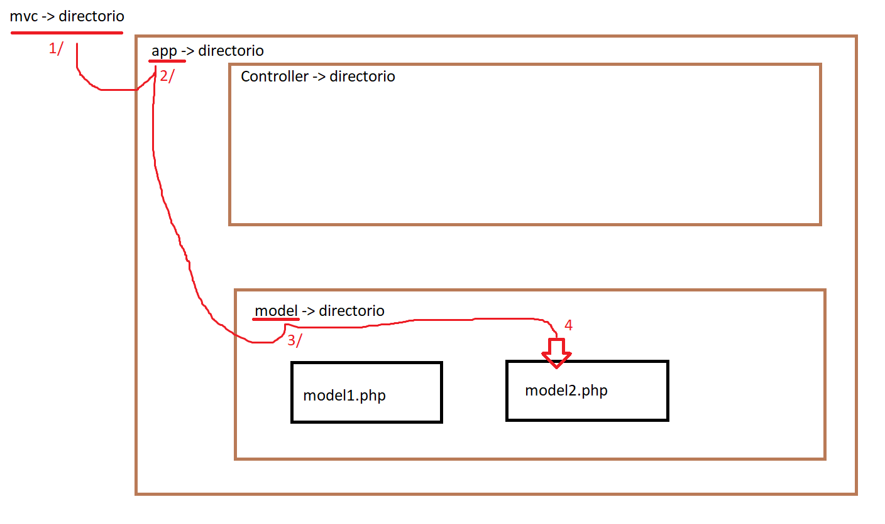<br>

* 1. Nos ubicamos en la ruta raíz del proyecto, eso lo hace la función getcwd().
* 2. Ahora accedmos al directorio app -> getcwd()."app/"
* 3. Luego tendremos a nuestra disposición los directorios de contorller y model, luego accedemos al direcotorio model -> getcwd()."app/model/"
* 4. Listo, sólo nos queda indicar el nombre del modelo con su extensión -> getcwd()."app/model/model2.php", listo, eso son los pasos para indicar la ruta de un archivo, en caso de ser un directorio no será necesario poner el nombre del archivo.

<hr>

_Procedemos a definir los directorios necesarios:_<br>
**config.php**
```php
<?php
// RUTA DEL SISTEMA
/**
 * Estas rutas son las ubicaciones de los directorios que contienen ficheros php
 */
define('DS'                 , DIRECTORY_SEPARATOR);
define('ROOT'               , getcwd().DS);
define('APP'                , ROOT.'app'.DS);


define('CONFIG'             , APP.'config'.DS);
define('CONTROLLER'         , APP.'controller'.DS);
define('MODEL'              , APP.'model'.DS);
define('CLASSES'            , APP.'classes'.DS);
// Rutas de archivos
define('DB'                 , CLASSES.'db.php');
define('ROUTERCONTROL'      , CLASSES.'router.php');

// Plantillas
define('VIEWS'              , ROOT.'views'.DS);
define('COMPONENTS'         , VIEWS.'components'.DS);
define('TEMPLATES'          , VIEWS.'templates'.DS);
define('STATIC_'             , VIEWS.'static'.DS);

//encabezado y pie
define('HEADER'             , TEMPLATES.'header.php');
define('FOOTER'             , TEMPLATES.'footer.php');
define("NAVIGATION"         , COMPONENTS."nav.php");

/**
 * Estas rutas son para archivos que se requieran para la presentación del archivo HTML, como imágenes, archivos css, js, etc.
 */
//rutas generales
// Definimos el nombre de la app y el servidor
define('SERVER', 'localhost');  // En desarrollo es localhost

define("NAMEAPP", "mvc");
define("ROUTEAPP","http://".SERVER."/".NAMEAPP);  // ruta http://localhost/mvc

// RUTA RECURSOS
define("ROUTECSS"           , ROUTEAPP.'/assets/css');
define("ROUTEJS"            , ROUTEAPP.'/assets/js');
define("ROUTEIMG"           , ROUTEAPP.'/assets/img');

```

También necesitaremos constantes para indicar los valores para la conexión a la base de datos.<br>
En el archivo de **config.php** añadimos las siguientes constantes.

```php
// RUTAS PARA BASE DE DATOS
define("SERVERDB", "localhost");
define("PORT", "3306");
define("NAMEDB", "productos__db");
define("USER", "root");
define("PASSWORD", "");

```

Dichos valores son los que tendrá por defecto nuestro gestor de base de datos que nos provee xampp, el dato que cambia es NAMEDB.

Ya tenemos listo nuestro config.php

Ahora tendremos que armar nuestro router.php<br>

**router.php**<br>

Dentro de este archivo lo que haremos es crear una clase la cuál tendrá un método que se encargará de leer los datos enviados en el navegador para instanciar un controlador y ejecutar un método.

```php
<?php
class RouterControl {
    public function route() {
        //1
        $this->sessionStart(); 
        // 2
        $controller = (isset($_REQUEST['c'])) ? $_REQUEST['c'] : 'Index';
        $action = (isset($_REQUEST['a'])) ? $_REQUEST['a'] : 'index';

        // 3.a
        $controller = strtolower($controller); 
        // 3.b
        $controller = ucwords($controller) . "Controller";
        // 4
        require_once CONTROLLER . $controller . ".php"; 
        // 5
        $controller = new $controller; 
        $controller->$action(); //llamada a la funcion del controlador (action) que se va a ejecutar 
    }
    public function sessionStart(){
        if (!isset($_SESSION)) {
            session_start();
        }
    }
}
```

Dentro del método route podemos observar que hay un proceso de selección del controlador.<br>
Funcionamiento:<br>

* 1. La línea de **$this->sessionStart();** nos indica que es una llamada a un método interno de la clase, la cuál se encarga de ejecutar la función de session_start, para el uso de la persistencia de datos.

* 2. Las líneas que tenemos ahí están guardando el nombre de los valores que llegan por el parámetro c de controller y a action o method.

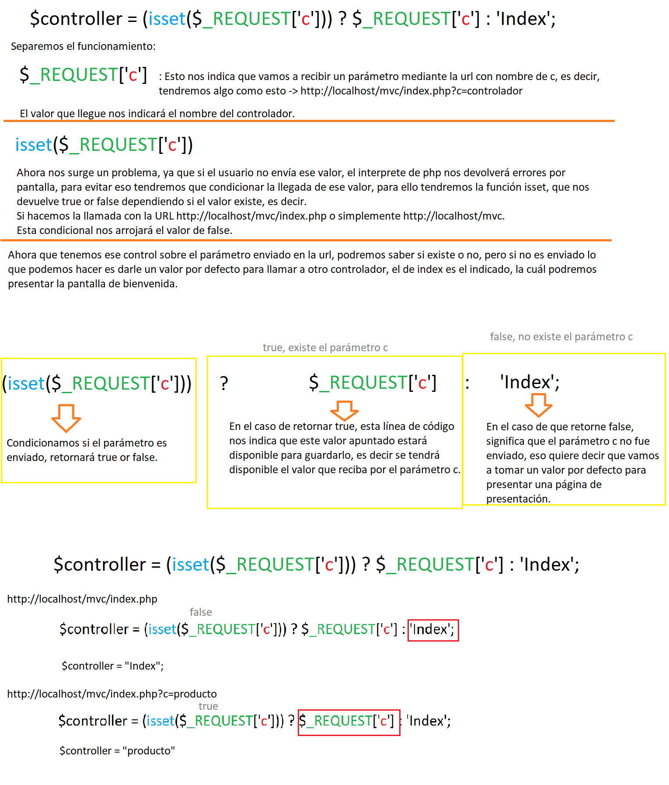<br>
Lo mismo pasa con la línea de $action, sólo que con el parámetro a y tomará por defecto el valor de index.

* 3. 
    * a. Usaremos la variable de $controller para convertirla a minúscula, ya el parámetro c podría venir con valore en mayúscula, ejemplo: c=inDeX, para ello la tendremos que convertir en minúscula, dejando así $controller = "index".
    * b. Después de pasarla a minúscula, convertiremos la primera letra a mayúscula para poder llamar al controlador, así evitamos de estar poniendo siempre la primer letra en mayúscula dentro de la url, esto quedaría con $controller="Index", seguido le concatenamos la palabra "Controller", entocnes tenemos => $controller = "IndexController".

* 4. Luego de hacer eso paso, intentamos incluir el fichero del controlador usando la constante CONTROLLER, la cuál tiene la ruta local del archivo, seguido del nombre del archivo que poseer el controlador, pero ese archivo tendrá una estructura de "Nombre_del_controlador" seguido de la palabra "Controller".

* 5. Ahora instanciamos la clase que está dentro del archivo incluido, y usamos la variable $controller para instanciarla, ya que esta es una variable dinámica y al intentar poner la palabra **new** y depués de una variable, intentará instanciar el contenido de la variable, el este caso quedaría $controller = new IndexController, reemplazando el valor de $controller, por último invocará el método con el nombre que guarda la variable $action.

Listo, ahora ya invocamos nuestro controlador.

<hr>

Ahora, tenemos que hacer la llamada del router en el archivo index.php principal, ya que este archivo siempre será llamado en la url, y en él se reemplazarán todo el código que se incluya en los diferentes archivos.<br>
**index.php**
```php
<?php
// Esto requerirá del archivo de configuracione para poder invocar a las constantes
require_once "app/config/config.php";
// Ahora requerimos el router, para eso usamos una constante que guarda la ruta
require_once ROUTERCONTROL;
// Lo instanciamos con el monbre de la clase
$ruteador = new RouterControl();
// Ejecutamos el método
$ruteador->route();
// Listo, ese será todo el contenido de index.php
?>
```
<hr>

Teniendo esto ya podremos usar un controlador y su método, así que creemos dos controladores, uno que se llame IndexControler.php y MascotasController.php dentro del directorio app>controller>.

* 📦 MVC
    * 📦 [app] ->
        * 📦 [classes] -> 
            * 📄 router.php
            * 📄 DB.php
        * 📦 [config] ->
            * 📄 config.php
        * 📦 [controllers]
            * 📄 IndexController.php
            * 📄 UserController.php
        * 📦 [models]
    * 📦 [assets] ->
        * 📦 [img]
        * 📦 [css]
        * 📦 [js]
    * 📦 [views]
    * 📄 index.php

**IndexController.php**<br>

Esta clase tendrá un método públic que se llamará index, el cuál presentará la pantalla de bienvenida, pero para la plantilla se necesitará guardar en archivos serparados, ya que el controlador sólo se encarga de hacer la llamada a la vista y no de tener una plantilla html incluida, la vista tendrá las plantillas html.

```php
<?php
// require_once 'config/config.php';
class IndexController{
    public function index(){
        $pageName="Indice";
        // Inlcuimos los archivos de header, en la mitad el archivo de index.php que tendrá la plantilla en html de bienvenida, no confundir con el archivo principal de index que está dentro de mvc
        include_once HEADER;
        include_once STATIC_.'index.php';
        include_once FOOTER;
    }
}

```

Crearemos los archivos necesarios:

* 📦 MVC
    * 📦 [app] ->
        * 📦 [classes] -> 
            * 📄 router.php
            * 📄 DB.php
        * 📦 [config] ->
            * 📄 config.php
        * 📦 [controllers]
            * 📄 IndexController.php
            * 📄 UserController.php
        * 📦 [models]
    * 📦 [assets] ->
        * 📦 [img]
        * 📦 [css]
            * 📄style.css
        * 📦 [js]
    * 📦 [views]
        * 📦 [components]
            * 📄 nav.php -> plantilla html
        * 📦 [static]
            * 📄 index.php -> plantilla html
        * 📦 [templates]
            * 📄 header.php -> plantilla html
            * 📄 footer.php -> plantilla html
    * 📄 index.php

<br>

**views/templates/header.php**

```html
<!DOCTYPE html>
<html lang="es">
<head>
    <meta charset="UTF-8">
    <title><?php echo $pageName?></title>
    <!-- Aquí incluimos código en php para incluir los archivos de css con las constantes de config -->
    <link rel="stylesheet" href="<?php echo ROUTECSS?>/style.css">
    <script src="<?php echo ROUTEJS?>/ajax.js"></script>
</head>
<body>
    <header>
        <?php include NAVIGATION;?>
    </header>
```

<br>

**views/templates/footer.php**

```html
</body>
</html>
```
Recuerde que todo se pintará en el index principal, todo el código de config.php, router.php, controladores, modelos se ubicarán en el archivo de index.php que ubicado en la raíz.

* 📦 MVC
    * 📄 index.php

Ahí se ubicará todo el código al momento de que php interprete todo el código, las plantillas html se verán reflejadas ahí con todo lo que se haya impreso con php.
<br>
En el navegador sólo aparecerá el texto dentro que se haya impreso con php y las etiquetas html que fueron puesta en los archivos.

**views/static/index.php**
```html
<h1>Bienvenido a la pestaña de index</h1>
```
```html
<nav class="nav-bar">
    <p class="logo">Logo</p>
    <span class="btn-menu flex flex-end">=</span>
    <ul class="no-list nav">
        <li><a href="index.php" class="flex-center active">Inicio</a></li>
        <li><a href="index.php?c=movie&a=query" class="flex-center">Peliculas</a></li>
        <li><a href="index.php?a=static&p=login" class="flex-center">Iniciar Sesión</a></li>
        <li><a href="index.php?a=static&p=signup" class="flex-center">Crear cuenta</a></li>
    </ul>
</nav>
```

**Nota: copiar código css en el archivo style.css ubicado en assets/css/ para añadir estilos**

```css
*{
    margin: 0;
    padding: 0;
}

.like{
    --color-btn: red;
}
.no-like{
    --color-btn: #474747;
}
/* Reutilizable */
.txt-center{
    text-align: center;
}
.flex-y{
    flex-flow: column;
}
.grid{
    display: grid;
} 
.grid-gap-10{
    grid-gap: 10px;
}
.grid-c-2{
    grid-template-columns: 1fr 1fr;
}
.no-list{
    list-style: none;
}
.flex{
    display: flex;
}
.space-btw{
    justify-content: space-between;
}
.flex-center{
    display: flex;
    align-content: center;
    justify-content: center;
}
.flex-end{
    justify-self: end;
}
/*  */
.nav-bar{
    display: grid;
    grid-template-columns: 1fr 1fr;
}

.nav:nth-child(3){
    grid-column: span 2;
}
.nav a{
    text-decoration: none;
    color: #000;
    display: flex;
    padding: 10px;
}

.nav li{
    /* background: red; */
    margin-left: 5px;
}
.nav li a.active, .nav li a:hover{
    border-bottom: 2px solid brown;
}
.logo{
    font-size: 1.5em;
    padding: 0 10px;
}
.btn-menu{
    cursor: pointer;
    padding: 5px;
    font-size: 1.7em;
}
@media(min-width: 750px){
    .btn-menu{
        display: none;
    }
    .nav-bar{
        display: flex;
        justify-content: space-between;
    }
    .nav-bar .nav{
        display: flex;
    }
}

.panel-profile{
    display: grid;
    grid-template-columns: 1fr 2fr;
}
.movies{
    margin: 40px auto;
    width: 80%;
}
.movies .panel{
    display: grid;
    grid-template-columns: repeat(4,1fr);
    max-height: 400px;
    grid-gap: 20px;
}
.movies .panel .card{
    width: 100%;
    min-height: 400px;
}
.movies .panel .card .picture{
    width: 100%;
    height: 350px;
}
.movies .panel .picture img{
    width: 100%;
    height: 100%;
}
.btn-like{
    background: var(--color-btn);
    padding: 10px 7px;
    color: #fff;
    text-decoration: none;
    border-radius: 50%;
}
.btn-c{
    width: 200px;
    padding: 5px 10px;
    border:  none;
    outline: none;
    margin: 10px auto;
    cursor: pointer;
    text-align: center;
    text-decoration:none;
}
.btn-c.edit{
    background: greenyellow;
}
.btn-c.remove{
    background: red;
}

.input{
    border: none;
    border-bottom: 1px solid #000;
    margin: 10px;
}
```
<hr>

Ahora observemos en el navegador seteando la ruta -> http://localhost/mvc/
<br>
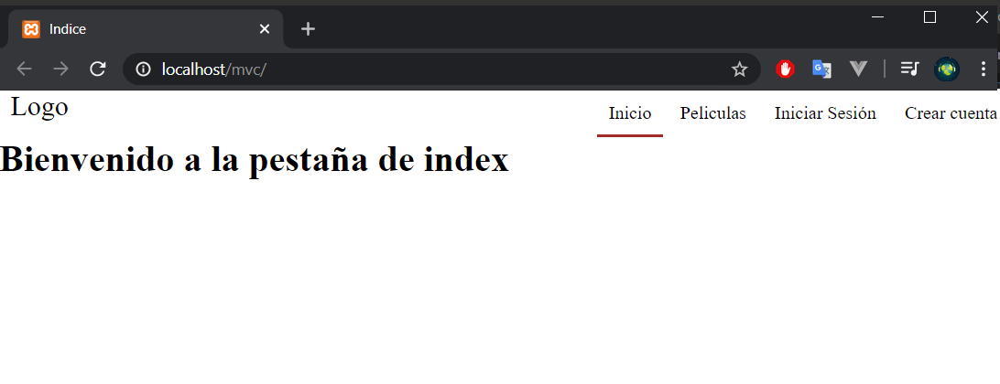<br>

Listo, ahora se puede observar el funcionamiento, también podremos probar indicandole el controlador y método.<br>
Probemos con estas url:

* http://localhost/mvc/?c=index
<br>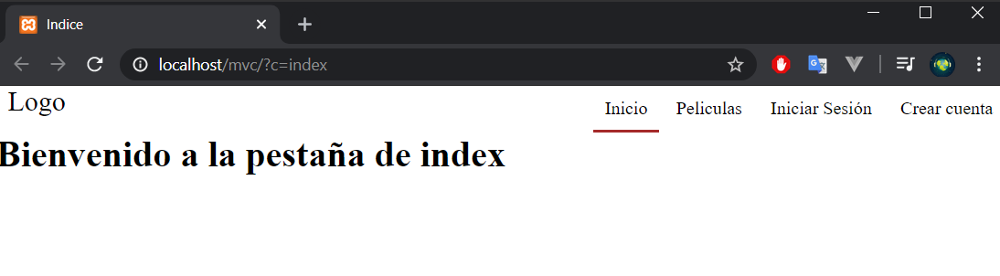<br>
Podemos observar que le hemos indicado a qué controlador llamar, pero no al método, tampoco al archivo index.php, pero no hubo problemas al presentar la pestaña.<br>
Tenemos dos observaciones:

* El método no fue enviado, pero en el código del router le indicamos que en ponga un valor por defecto en caso de que el parámetro "**a**" no fuese enviado, entonces, el controlador tomará **IndexController** y la acción tomará el valor por defecto, **index**, ahora sabemos que se llamará el método index de la clase **IndexController*.

* El archivo "index.php" no se definió en la url, por defecto el servidor buscará algún archivo llamado index.html o index.php en caso de no especificar, si no lo encuentra mostrará la ventana de archivo no encontrado, pero nosotro si tenemos ese archivo, por eso se mostró la pantalla sin errores.

* http://localhost/mvc/?c=index&a=index

<br>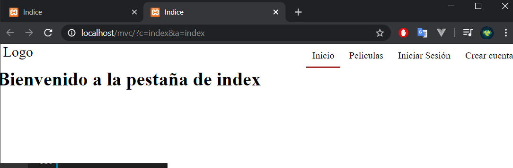<br>

En esta url le indicamos el controlador y el método a ejecutarse.<br>

* http://localhost/mvc/index.php?c=index&a=index

<br>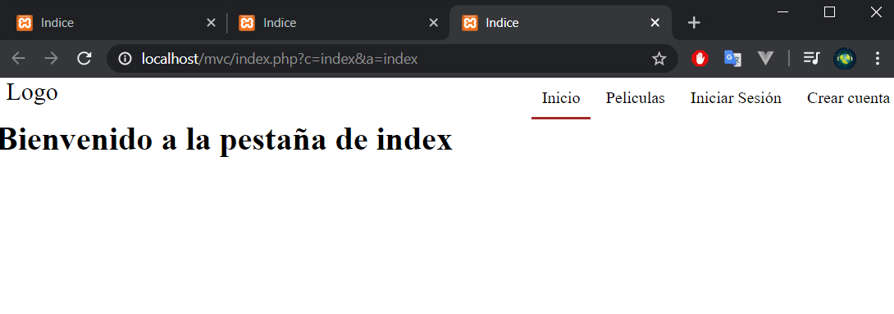<br>

En esta url le indicamos el controlador y el método a ejecutarse, pero también el archivo a llamarse.<br>

* http://localhost/mvc/index.php?c=no_existe

Ahora le hacemos una petición al servidor indicándole un controlador que no existe, nos indicará que hay un error, por lo que intenta incluir un archivo que no existe.<br>
**Mpetodo de route - router.php**

```php
$controller = (isset($_REQUEST['c'])) ? $_REQUEST['c'] : 'Index';
// Lectura de c = no_existe
$action = (isset($_REQUEST['a'])) ? $_REQUEST['a'] : 'index';
// $action = index  -- valor por defecto

$controller = strtolower($controller); 
// $controller = "no_existe"

$controller = ucwords($controller) . "Controller";
// $controller = "No_existeController"
/*
    Ahora tenemos un controlador que no existe dentro de nuestros archivos.
    En la siguiente línea intentará incluir un archivo llamado No_existeController.php, el cuál no existe.
    Nos mostrará la advertencia al abrir un archivo que no existe, y un error al intentar incluirlo con require_once, posteriormente no seguirá con la lectura del código.
*/
require_once CONTROLLER . $controller . ".php"; 
```
<br>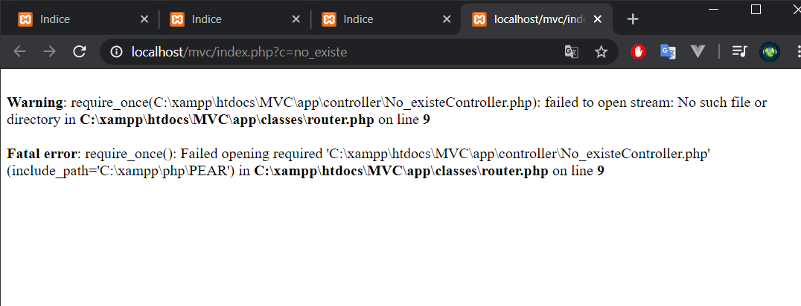<br>

* http://localhost/mvc/?c=index&a=metodo_no_xiste

<br>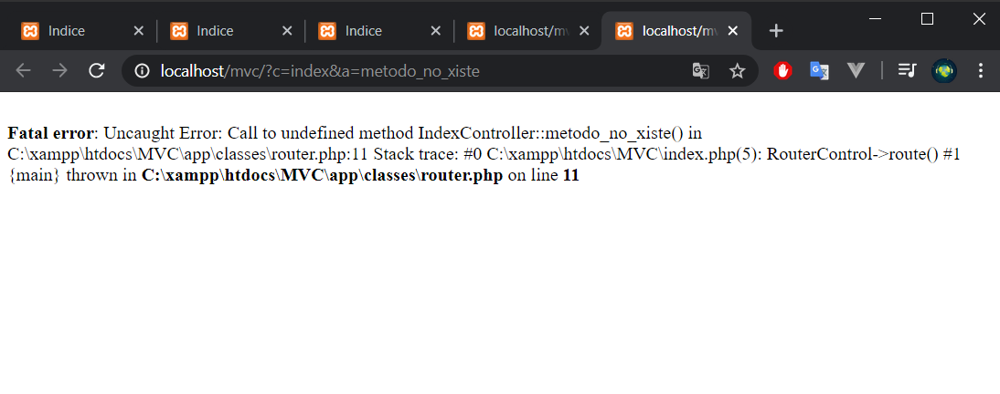<br>

En este caso le damos el valor de un controlador existente pero intentamos invocar a un método que no existe.

```php
$controller = (isset($_REQUEST['c'])) ? $_REQUEST['c'] : 'Index';
// Lectura de c = index
$action = (isset($_REQUEST['a'])) ? $_REQUEST['a'] : 'index';
// $action = "metodo_no_xiste"

$controller = strtolower($controller); 
// $controller = "index"

$controller = ucwords($controller) . "Controller";
// $controller = "IndexController"
require_once CONTROLLER . $controller . ".php"; 
$controller = new $controller; 
// $controller = new IndexController
$controller->$action();
// $controller->metodo_no_xiste();
/*
    Este método no existe en la clase de IndexController, ya que sólo tenemos un método llamado index(), entonces nos mostrará un error por pantalla indicando que intenta llamar a un método que no ha sido definido en la clase
*/
```

Lo indicado sería verificar si el archivo y el método existen, caso contrario podemos mostrar una pantalla de 404, pero eso lo dejaremos para otra presentación.

Listo, ya tenemos el control de las rutas para invocar un controlador y presentar una vista.

El siguiente paso es crear nuevos controladores con métodos.

## Aplicación 

Intentaremos realizar una aplicación web que permita loguear usuarios de tipo administrador.

También tendrá un módulo completo para películas, entonces a un módulo completo con interacción a base de datos le denominaremos **CRUD** (CREATE READ UPDATE and DELETE), es decir podremos ver todas las películas, añadir nuevas, eliminar y actualizar.

Tendremos ciertas reglas:<br>

* Todos podrán visualizar las películas.
* Un usuario logueado será el administrador.
* El usario administrador tendrá la opción de añadir, editar y eliminar las películas.

Definimos la estructura de datos.

Película - movie:

* id_movie (int, auto incremento, pk)
* nombre (varchar, no nulo)
* Categoría (varchar, no nulo)
* detalle (varchar, no nulo)
* image_url (varchar)
* fecha_creación (date_time)
* status (int, 1) -- estado de la película, borrado lógico

Usuario - user:

* id_user (int, auto incremento, pk)
* username (varchar, no nulo)
* password (varchar, no nulo)
* type_user (varchar, no nulo)

Listo, ahora tendremos que crear la base de datos, para ello usaremos mysql ya que estamos usando xampp que nos trae el administrado de base de datos mysql.

Nos tocará encender la opción de mysql en xampp-control.
<br>
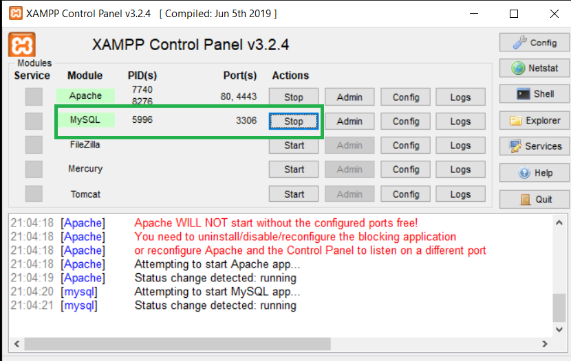<br>

En caso de tener algún error tendrá que revisar los puertos del sistema operativo, mysql ocupa por defecto el puerto 3306.

Ahora crearemos la base de datos
```sql
DROP DATABASE IF EXISTS app_movie_php;
create DATABASE app_movie_php;
use app_movie_php;

-- tabla de usuario
CREATE table user_(
    id_user int AUTO_INCREMENT,
    username varchar(30) not null,
    password varchar(20) not null,
    type_user varchar(20) not null DEFAULT "comun",
    PRIMARY KEY (id_user)
);
-- crear datos
insert into user_(id_user,username,password,type_user)
    values
    (1,"admin","admin","admin"),
    (2,"root","root","admin");

-- Tabla de categoría
create table ctg_movie(
    id_ctg int AUTO_INCREMENT,
    name_ctg varchar(30) not null,
    PRIMARY KEY (id_ctg)
)ENGINE = InnoDB CHARSET=utf8mb4 COLLATE utf8mb4_unicode_ci;

insert into ctg_movie(name_ctg)
    values("De terror"),("Dramáticas"),("Musicales"),("Ciencia ficción"),
    ("De guerra o bélicas"),("Películas del Oeste"),("Crimen");
    
-- Tabla de película
create table movie(
    id_movie int AUTO_INCREMENT,
    name_movie varchar(30) not null,
    sipnosis varchar(30) not null,
    url_img varchar(100) not null,
    id_ctg int not null,
    status int DEFAULT 1,
    PRIMARY KEY (id_movie),
    FOREIGN KEY (id_ctg) REFERENCES ctg_movie(id_ctg)
)ENGINE = InnoDB CHARSET=utf8mb4 COLLATE utf8mb4_unicode_ci;
insert into movie(id_movie, name_movie, sipnosis, url_img,id_ctg)
    values
        (1, "pelicula 1", "sipnosis","assets/img/movies/img1.jpg",1),
        (2, "pelicula 2", "sipnosis","assets/img/movies/img2.jpg",1),
        (3, "pelicula 3", "sipnosis","assets/img/movies/img3.jpg",3),
        (4, "pelicula 4", "sipnosis","assets/img/movies/img4.jpg",4),
        (5, "pelicula 5", "sipnosis","assets/img/movies/img5.jpg",4);
```

Ahora para poder crear esa base de datos en mysql ingresamos en el navegador con la siguiente url.<br>

* http://localhost/phpmyadmin/

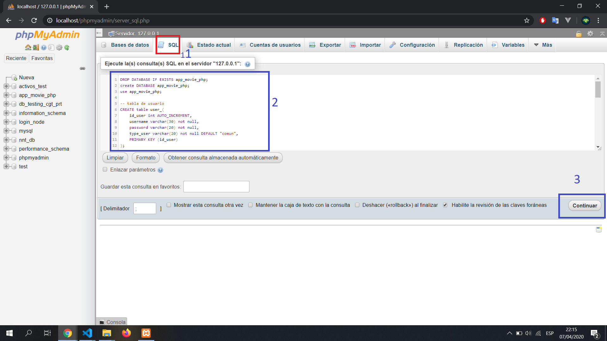

* 1. Ahora damos clic en **SQL** .
* 2. Después pegaremos el código sql para la base de datos.
* 3. Le daremos clic en contrinuar para que construya la base de datos.

<br>
Luego observaremos que todo ha ido correcto y podemos seguir con la estructura de MVC.

<hr>

## PHP Y PDO 


Para poder conectar php con una base de datos tenemos a nuestra disposición ciertas librerías para hacer esto posible, una de las más conocidas es [mysqli](https://www.w3schools.com/pHP/php_ref_mysqli.asp), pero en este usaremos [PDO](https://diego.com.es/tutorial-de-pdo) porque es actual y trabaja con POO.<br>

PDO en php posee una clase la cuál se instanciará con 3 parámetros:

* $host = contendrá la ubicación de la base de datos (localhost - de manera local), seguido del puerto y el nombre de la base de datos
* $user = nombre de usuario administrador de la base de datos
* $password = contraseña del usuario administrador de la base de datos.

```php
$host = "mysql:host=localhost;dbname=base_datos";
$dbh = new PDO($host, $user, $password);
```

Listo, ahora tendremos la instancia a la base de datos, si todos lo campos son correctos no tendremos ningún error.

Ahora nos dirigimos a **app/classes/DB.php** para crear una clase y métodos para intentar conectar a la base de datos, pero antes tendremos que ubicarnos en el archivo de configuración para revisar las constantes que tendrán información de la base de datos.<br>

**app/config/config.php**
```php
// RUTAS PARA BASE DE DATOS
define("SERVERDB", "localhost");
define("PORT", "3306");
define("NAMEDB", "app_movie_php");
// En este caso el nombre de la base de datos ha cambiado
define("USER", "root");
define("PASSWORD", "");

```

**app/classes/DB.php**
```php
<?php
class Connection{ 
    // patron de disenio singleton
    private static $connection = null; //atributo static y private
   
    //constructor privado para que solo dentro de esta clase pueda crearse objetos
    private function __construct() {
    }
    
    public static function getConnection(){
        try{
            // si no existe la conexion se crea
            if(!isset(self::$connection)){
                self::$connection = 
                    new PDO(
                                "mysql:host=" . SERVERDB . "; port= ".PORT."; dbname=" . NAMEDB, 
                                USER, 
                                PASSWORD
                            );  
                // se inicializa db con la conexion de tipo PDO a la base de datos (motor mysql)
                
                self::$connection->setAttribute(PDO::ATTR_ERRMODE,PDO::ERRMODE_EXCEPTION); 
                self::$connection->exec("set character set utf8");
            }
        }catch(Exception $e){
            die(sprintf('No  hay conexión a la base de datos, hubo un error: %s', $e->getMessage()));
            return null;
        }
        return self::$connection;
    }
}
```

En esta clase hemos creato un método estático, retornará la conexión con la base de datos, con eso ya podremos usar para hacer sentencias sql, para consultar y modificar los campos de las tablas.

Podremos probar el código debemos modificar el archivo index.php principal por un momenrto.<br>
**index.php**.<br>
```php
<?php
require_once "app/config/config.php";
// require_once ROUTERCONTROL;
// $ruteador = new RouterControl();
// $ruteador->route();
require_once DB;
$connection =  DB::getConnection();
var_dump($connection);

// Comentamos las líneas del enrutador y añadimos la de la base de datos para testear, luego intentamos imprimir el contenido
?>
```

Para probar el error se ha modificado el nombre de la base de datos en el archivo config.php, pero esto es sólo para pruebas.

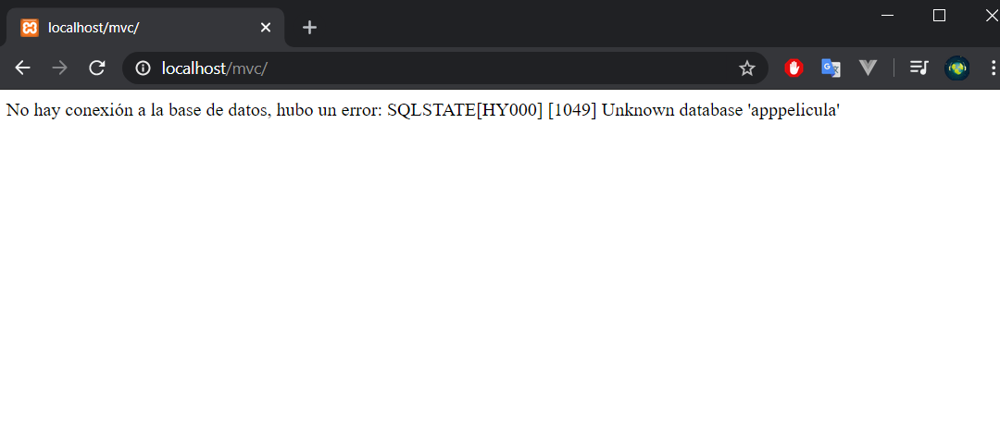
<br>
Luego se puede observar que nos indica cuál es el error de conexión, procedemos a corregirla haciendo los cambios necesarios en el código.
<br>
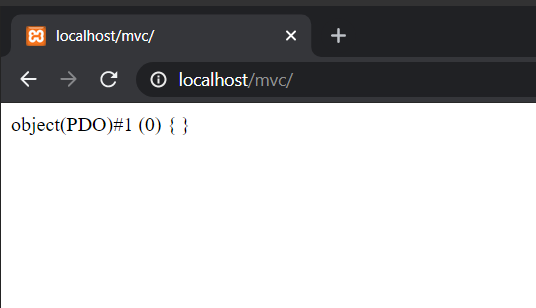
<br>
Ahora que tenemos ese objeto visible en el navegador sabemos que la conexión con la base de datos fue exitosa.

Después volvemos a dejar el archivo index.php como estaba antes de testear la conexión a la DB.<br>
**index.php**
```php
<?php
require_once "app/config/config.php";
require_once ROUTERCONTROL;
$ruteador = new RouterControl();
$ruteador->route();
?>
```

**Nota: comentar la línea<br>  //die(sprintf('No  hay conexión a la base de datos, hubo un error: %s', $e->getMessage())); <br>En DB.php.**

## Models

Primero empezaremos a construir los modelos para para que sean llamados desde el controlador. 

Tenemos dos modelos a construir.

* UserModel.
* MovieModel.

* 📦 MVC
    * 📦 [app] ->
        * 📦 [models]
            * 📄 MovieModel.php
            * 📄 UserModel.php
    * 📄 index.php

Listo, ahora empezaremos por el modelo de Película que es el más completo.

**MovieModel.php**
```php
<?php
class MovieModel{}
```

Ahora tendremos que poner sus atributos, los cuales correponden a los campos agregados en la base de datos de la tabla movie.<br>
**MovieModel.php**

```php
<?php
class MovieModel{
    public $id_movie;
    public $name_movie;
    public $sipnosis; 
    public $url_img; 
    public $id_ctg;
}
```

Listo, ahora ya tenemos los atributos del modelo.

Ahora tendremos que crear los métodos para crear, editar, crear y eliminar.<br>
**MovieModel.php**

```php
<?php
class MovieModel{
    public $id_movie;
    public $name_movie;
    public $sipnosis; 
    public $url_img; 
    public $id_ctg;

    public function query(){}
    public function create(){}
    public function update(){}
    public function delete(){}
}
```

<hr>

Ahora la primera funciónque probaremos es la de consultar los datos de las películas.

Pasos:

* Primero debemos tener la conexión con la base de datos, pero ya habíamos creado un clase que hace eso, por lo tanto, debemos ejecutar la función que retorna la conexión, y ese valor lo guardamos en una variable para poder hacer la consulta.
* Después de obtener la conexión debemos preparar la sentencia para poder ejecutarla, esto quiere decir que vamos a poner cualquier sentencia (sql en este caso) para poder hacer una consultar a la base de datos.
* Después nos tocará ejecutar la sentencia y nos tocará enviar valores que reemplacen las incógnitas que hemos puesto en la sentencia, es decir:

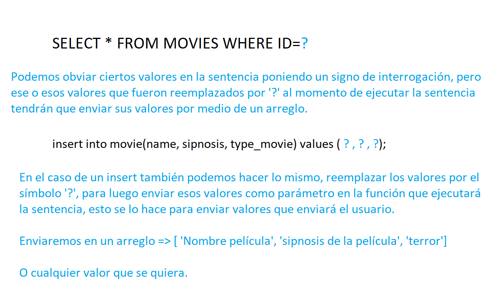<br>

*Luego de eso podremos obtener los valores.

PDO nos ofrece varias maneras de obtener valores: 

Supongamos que tenemos esa tabla con esos datos.

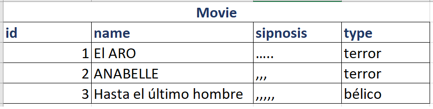

PDO nos ofrece diferentes constantes con las cuales podremos obtener los datos de diferentes maneras.

Para ello tendremos que ejecutar el método fetchAll(Arreglo de datos) o fetch (Un sólo dato).

```php
 $resultSet = $sentencia->fetchAll(PDO::CONSTANTE);
```

Tenemos una lista de ellos (Reemplazarán la palabra **CONSTANTE**:

* PDO::FETCH_ASSOC

Esta constante hará que los datos retornen como arreglos, es decir, dentro del arreglo habrá un arreglo por cada fila de datos que obtenga.

En la tabla que tenemos de ejemplo tendremos tres datos, por lo que retornará tres arreglos dentro de la lista principal, pero para poder acceder a un dato de ellos tendremos que acceder por medio del índice asociativo, es decir por su nombre.

```php

[
    // PRIMER DATO
    [
        "id"        =>  "1",
        "name"      =>  "El ARO",
        "type"      =>  "terror",
        "sipnosis"  =>  ".....",
    ],
     // SEGUNDO DATO
    [
        "id"        =>  "2",
        "name"      =>  "ANABELLE",
        "type"      =>  "terror",
        "sipnosis"  =>  ".....",
    ],
     // TERCER DATO
    [
        "id"        =>  "3",
        "name"      =>  "Hasta el último hombre",
        "type"      =>  "bélico",
        "sipnosis"  =>  ".....",
    ],
];

// Supongamos que esos datos estén guardados en la variable $arr

// Para acceder a ellos tenemos que tener un índice comencemos por el primer elemento
$arr[0];
// Ahora podremos acceder por su índice asociativo.
$arr[0]["name"] -> estamos obteniendo el nombre del esa fila ("EL ARO")
```

* PDO::FETCH_NUM


Esta constante hará que los datos retornen como arreglos, es decir, dentro del arreglo habrá un arreglo por cada fila de datos que obtenga.

En la tabla que tenemos de ejemplo tendremos tres datos, por lo que retornará tres arreglos dentro de la lista principal, pero para poder acceder a un dato de ellos tendremos que acceder por medio del índice **numérico**, a diferencia del anterior, este arreglo no tendrá los nombre de esos datos.

```php

[
    // PRIMER DATO
    [
        "1",
        "El ARO",
        ".....",
        "terror",
    ],
     // SEGUNDO DATO
    [
        "2",
        "ANABELLE",
        ".....",
        "terror",
    ],
     // TERCER DATO
    [
        "3",
        "Hasta el último hombre",
        ".....",
        "bélico",
    ],
];

// Supongamos que esos datos estén guardados en la variable $arr

// Para acceder a ellos tenemos que tener un índice comencemos por el primer elemento
$arr[0];
// Ahora podremos acceder por su índice numérico, el orden depende del orden de los campos de la base de datos.
$arr[0][2] -> estamos obteniendo el nombre del esa fila ("terror")
```

* PDO::FETCH_OBJ 

Esta constante hará que los datos retornen como objetos anónimos, es decir, dentro del arreglo principal habrá objetos de datos con parámetros.

Es como si hubiesen sido instanciados por medio de una clase, los parámetros serán los nombres de los campos de la tabla y los valores serán los datos almacenados en cada campo.

```php

[
    // PRIMER DATO
    {
        $id = "1";
        $name ="EL ARO";
        $type = "terror";
        $sipnosis = ".....";
    },
     // SEGUNDO DATO
     {
        $id = "2";
        $name ="ANABELLE";
        $type = "terror";
        $sipnosis = ".....";
    },
     // TERCER DATO
    {
        $id = "3";
        $name ="Hasta el último hombre";
        $type = "bélico";
        $sipnosis = ".....";
    },
];

// Supongamos que esos datos estén guardados en la variable $arr

// Para acceder a ellos tenemos que tener un índice comencemos por el primer elemento
$arr[0];

// Ahora para acceder a los campos nos tocará tratarlo como si fuera un objeto común, es decir en vez de obtenerlo por un índice nos toca obtenerlos como si fuera atributos.

$arr[0]->name
$arr[0]->sipnosis
$arr[0]->type
$arr[0]->id
// Listo
```

Existen otras constantes más, si desea puede verificar en la documentación [manual pdo constants](https://www.php.net/manual/en/pdo.constants.php).

La que usaremos por mayor facilidad de uso será FETCH_OBJ.

<hr>

Sigamos agregando código al modelo de película.

**MovieModel.php**

Necesitaremos un atributo interno para la conexión y obtendremos su valor de la clase de **DB.php**.

Pasos:

* Incluir el archivo DB.php, para eso usaremos la constante que definimos en config.php llamada **DB** que trae la ruta del archivo. **Cod-A**
* Declarar un atributo de conexión en la clase y será privado ya que sólo se usará en esta clase. **Cod-B**
* Creamos el construtor de la clase y dentro de ella inicializamos la conexión por medio de la clase DB, notese que no usamos **"->"** para ejecutar el método sino que usamos **"::"**, esto pasa porque ese método se lo ha definido estático dentro de la clase, o sea que sólo se podrá ser accedido a él por medio del nombre de la clase y ejecutándolo anteponiendo **::** **Cod-C**

```php
<?php
require_once DB; //Cod-A
class MovieModel{
    private $conn; //Cod-B

    public $id_movie;
    public $name_movie;
    public $sipnosis; 
    public $url_img; 
    public $id_ctg;

    /**
    * Constructor, incializa la conexión. Cod-C
    */
    public function __construct(){
        $this->conn =  DB::getConnection();
        // Con esto ya tenemos la conexión en caso de que el motor de base de datos mysql estén encendido y los datos estén correctos (PUERTO, HOST, USUARIO, PASSWORD)
    }

    public function query(){}
    public function create(){}
    public function update(){}
    public function delete(){}
}
```

Ahora codificaremos el contenido del método query

* Primero tendremos que condicionar que el valor de $conn no sea nulo, de lo contrario nos daría un error.**Cod-A-1**
* Después de eso podemos colocar la sentencia usando la función de prepae y enviado la sentencia sql como valor en cadena de caracteres.**Cod-A-2**
* Ahora ejecutamos la sentencia con la variable que usamos para obtener el valor de la sentencia preparada.**Cod-A-3**
* Luego de ejecutarla podremos obtener los datos por medio de PDO y fectchAll, dentro enviamos la clase de PDO y llamamos a la constante que quedramos para obtener los valores, en este caso usamos FETCH_OBJ.**Cod-A-4**
* Después retornamos los datos.**Cod-A-5**

```php
public function query(){
    if(is_null($this->conn)) return []; // si es nulo, retorna el arreglo vacío

    // Sino ejecuta la sentencia.
    // Preparamos un try catch en caso de que ocurra un error
    try{
        // Esta sentencia trae los valores de las películas con sus categorías
        $query = "SELECT * FROM movie inner join ctg_movie as c on c.id_ctg = movie.id_ctg where status=1;";
        $sentencia = $this->conn->prepare($query); // .**Cod-A-2**
        $sentencia->execute([]);          //.**Cod-A-3**
        $resultSet = $sentencia->fetchAll(PDO::FETCH_OBJ); //.**Cod-A-4**
        return $resultSet;
    }catch(Exception $e){
        /*
        En caso de haber algún error se puede descomentar estas líneas para mostar cuál fue el error
        */
        // die($e->getMessage());
        // die($e->getTrace()); // traza del error
        return [];//.**Cod-A-5**
    }
}
```

Ahora tocará hacer los siguiente métodos, los pasos son similare, sólo cambiará la sentencia sql, y ya no se obtendrá los datos que están en la tabla, sólo se obtendrá el valor de la cantidad de datos insertados o actualizados.

```php
public function create(){
    if(is_null($this->conn)) return []; // si es nulo, retorna el arreglo vacío
    try{
        $sentencia = $this->conn->prepare(
            "insert into movie (name_movie,sipnosis,url_img,id_ctg)".
            " values (?,?,?,?);"
        );
        // Ahora tendremos que preparar un array de valores para enviarlos y que sean reemplazados por los signos "?"
        $parametros = array(
            $this->name_movie,
            $this->sipnosis,
            $this->url_img,
            $this->id_ctg,
        );
        // Dichos datos son enviados al ejecutar
        $sentencia->execute($parametros);
        // Ahora tendremos que retornar el valor de cambios que se hizo para saber si los valores se guardaron o no
        // Para eso usamos la función rowCount
        return $sentencia->rowCount();
    }catch(Exception $e){
        /*
        En caso de haber algún error se puede descomentar estas líneas para mostar cuál fue el error
        */
        // die($e->getMessage());
        // die($e->getTrace()); // traza del error
        return [];
    }
}
```

Las funciónes de actualizar y eliminar sólo cambiarán en la sentencia y los parámetros que se envíen

El modelo quedaría así.<BR>
Se ha añadido un nuevo método para consultar las categorías de las películas. <br>
**MovieModel.php**

```php
<?php
require_once DB; //Cod-A
class MovieModel{
    private $conn; //Cod-B

    public $id_movie;
    public $name_movie;
    public $sipnosis; 
    public $url_img; 
    public $id_ctg;

    /**
    * Constructor, incializa la conexión. Cod-C
    */
    public function __construct(){
        $this->conn =  DB::getConnection();
        // Con esto ya tenemos la conexión en caso de que el motor de base de datos mysql estén encendido y los datos estén correctos (PUERTO, HOST, USUARIO, PASSWORD)
    }

    public function query(){
        if(is_null($this->conn)) return []; // si es nulo, retorna el arreglo vacío

        // Sino ejecuta la sentencia.
        // Preparamos un try catch en caso de que ocurra un error
        try{
            $query = "SELECT * FROM movie inner join ctg_movie as c on c.id_ctg = movie.id_ctg where status=1;";
            $sentencia = $this->conn->prepare($query); // .**Cod-A-2**
            $sentencia->execute([]);          //.**Cod-A-3**
            $resultSet = $sentencia->fetchAll(PDO::FETCH_OBJ); //.**Cod-A-4**
            return $resultSet;
        }catch(Exception $e){
            /*
            En caso de haber algún error se puede descomentar estas líneas para mostar cuál fue el error
            */
            // die($e->getMessage());
            // die($e->getTrace()); // traza del error
            return [];
        }
    }
// Agregamos un método para buscar un sólo registro
    public function queryOne(){
        if(is_null($this->conn)) return null; // si es nulo, retorna el arreglo vacío

        // Sino ejecuta la sentencia.
        // Preparamos un try catch en caso de que ocurra un error
        try{
            $query = "SELECT * FROM movie WHERE id_movie = ?;";
            $sentencia = $this->conn->prepare($query); // .**Cod-A-2**
            $sentencia->execute([$this->id_movie]);          //.**Cod-A-3**
            $resultSet = $sentencia->fetch(PDO::FETCH_OBJ); //.**Cod-A-4**
            return $resultSet;
        }catch(Exception $e){
            /*
            En caso de haber algún error se puede descomentar estas líneas para mostar cuál fue el error
            */
            // die($e->getMessage());
            // die($e->getTrace()); // traza del error
            return null;
        }
    }
    public function create(){
        if(is_null($this->conn)) return []; // si es nulo, retorna el arreglo vacío
        try{
            $sentencia = $this->conn->prepare(
                "insert into movie (name_movie,sipnosis,url_img,id_ctg)".
                " values (?,?,?,?);"
            );
            // Ahora tendremos que preparar un array de valores para enviarlos y que sean reemplazados por los signos "?"
            $parametros = array(
                $this->name_movie,
                $this->sipnosis,
                $this->url_img,
                $this->id_ctg,
            );
            // Dichos datos son enviados al ejecutar
            $sentencia->execute($parametros);
            // Ahora tendremos que retornar el valor de cambios que se hizo para saber si los valores se guardaron o no
            // Para eso usamos la función rowCount
            return $sentencia->rowCount();
        }catch(Exception $e){
            /*
            En caso de haber algún error se puede descomentar estas líneas para mostar cuál fue el error
            */
            // die($e->getMessage());
            // die($e->getTrace()); // traza del error
            return [];
        }
    }
    public function update(){
        if(is_null($this->conn)) return []; // si es nulo, retorna el arreglo vacío
        try{
            $sentencia = $this->conn->prepare(
                "update movie set name_movie=? , sipnosis=? , url_img=? ,id_ctg=? ".
                " where id_movie=? "
            );
            // Ahora tendremos que preparar un array de valores para enviarlos y que sean reemplazados por los signos "?"
            $parametros = array(
                $this->name_movie,
                $this->sipnosis,
                $this->url_img,
                $this->id_ctg,
                $this->id_movie,
            );
            // Dichos datos son enviados al ejecutar
            $sentencia->execute($parametros);
            // Ahora tendremos que retornar el valor de cambios que se hizo para saber si los valores se guardaron o no
            // Para eso usamos la función rowCount
            return $sentencia->rowCount();
        }catch(Exception $e){
            /*
            En caso de haber algún error se puede descomentar estas líneas para mostar cuál fue el error
            */
            // die($e->getMessage());
            // die($e->getTrace()); // traza del error
            return [];
        }
    }
    public function delete(){
        if(is_null($this->conn)) return []; // si es nulo, retorna el arreglo vacío
        try{
            $sentencia = $this->conn->prepare(
                "update movie set status=0 where id_movie=? "
            );
            // En vez de eliminar los datos cambiaremos el estado a 0 que reflejará que ha sido elimiado
            $parametros = array(
                $this->id_movie,
            );
            // Dichos datos son enviados al ejecutar
            $sentencia->execute($parametros);
            // Ahora tendremos que retornar el valor de cambios que se hizo para saber si los valores se guardaron o no
            // Para eso usamos la función rowCount
            return $sentencia->rowCount();
        }catch(Exception $e){
            /*
            En caso de haber algún error se puede descomentar estas líneas para mostar cuál fue el error
            */
            // die($e->getMessage());
            // die($e->getTrace()); // traza del error
            return [];
        }
    }
    /**
     * Obtener todas las categorías
     */
    public function get_category(){
        if(is_null($this->conn)) return []; // si es nulo, retorna el arreglo vacío

        // Sino ejecuta la sentencia.
        // Preparamos un try catch en caso de que ocurra un error
        try{
            $query = "SELECT * FROM ctg_movie";
            $sentencia = $this->conn->prepare($query); // .**Cod-A-2**
            $sentencia->execute([]);          //.**Cod-A-3**
            $resultSet = $sentencia->fetchAll(PDO::FETCH_OBJ); //.**Cod-A-4**
            return $resultSet;
        }catch(Exception $e){
            /*
            En caso de haber algún error se puede descomentar estas líneas para mostar cuál fue el error
            */
            // die($e->getMessage());
            // die($e->getTrace()); // traza del error
            return [];
        }
    }
}

```

<hr>

Ahora pocederemos a construir el modelo de usuario en el que sólo tendra una función de query
```php
<?php
require_once DB; 
class UserModel{
    private $conn;

    public $username;
    public $password;
    public function __construct(){
        $this->conn =  DB::getConnection();
    }

    public function query(){
        if(is_null($this->conn)) return null; // si es nulo, retorna un dato nulo
        try{
            $query = "SELECT username FROM user_ where username = ? and password = ?;";
            $sentencia = $this->conn->prepare($query); 
            $sentencia->execute(
                [
                    $this->username,
                    $this->password,
                ]
            );
            // Usaremos la función fetch para obtener un solo dato
            $resultSet = $sentencia->fetch(PDO::FETCH_OBJ); 
            return $resultSet;
        }catch(Exception $e){
            /*
            En caso de haber algún error se puede descomentar estas líneas para mostar cuál fue el error
            */
            // die($e->getMessage());
            // die($e->getTrace()); // traza del error
            return null;
        }
    }
}
```

Realmente no hay muchos cambios

Se podría usar una contraseña encriptada que es lo ideal pero por el momento es suficiente para probar las funcionalidades básicas.

<hr>

## CONTROLADORES

Ahora tendremos que construir los controladores para poder hacer la lamada a los módulos.

Los controladores que vamos a crear serán:
* UserController
* MovieController

* 📦 MVC
    * 📦 [app] ->
        * 📦 [controller]
            * 📄 IndexController.php
            * 📄 MovieController.php
            * 📄 UserController.php
    * 📄 index.php

Empezaremos por el más fácil que es el de UserController ya que tendrá pocas funciones:

* Iniciar sesión -> Tendrá que recibir dos parámetros enviados por POST que serán username y password y se guardará el nombre de usuario e una sesión.
* Cerrar sesión -> eliminará las sesiones guardadas.

```php
<?php
class UserController{
}
```

Ahora necesitaremos incluir su modelo para poder inciar sesión con la base de datos.

```php
require_once MODEL."UserModel.php";
class UserController{
}
```

Listo, ahora tenemos disponible el modelo para poder usar su clase, entonces, ahora necesitaremos un atributo que instancie esa clase para poder usarla en toda la clase del controlador, lo llamaremos userModel y lo procedemos a instanciar en el constructor, esto se instanciará con la clase UserModel ya que se está incluyendo el archivo que contiene esa clase.

```php
<?php
require_once MODEL."UserModel.php";
class UserController{
    private $userModel;
    public function __construct(){
        $this->userModel=new UserModel();
    }
}
```

Ahora podremos crear métodos en el controlador y usar los métodos del modelo para el inicio de sesión dentro de los métodos del controlador por medio del objeto creado ($userModel).

```php
<?php
require_once MODEL."UserModel.php";
class UserController{
    private $userModel;
    public function __construct(){
        $this->userModel=new UserModel();
    }
    public function login(){   }
    public function logout(){   }

    public function view(){
        include_once HEADER;
        include_once STATIC_. "login.php";
        include_once FOOTER;
        
    }
}
```

Listo, ahora necesitaremos incluir el código necesario para esos métodos.

* Login.- Se encargará de leer los datos enviados por POST (username y password), validar que existan, ejecutar el método de inicio de sesión del modelo, antes de eso habría que pasarle los datos del usuario, por último validar que retorne el usuario y guardarlo en una sesión.

* Logout eliminar la sesión de usuario.


```php
<?php
require_once MODEL."UserModel.php";
class UserController{
    private $userModel;
    public function __construct(){
        $this->userModel=new UserModel();
    }
    public function login(){
        //  Condicionar si los datos existen
        $pageName="Login";
        if(  isset( $_POST["username"] )  &&  isset( $_POST["password"] )  ){
            // Asignar los valores a los atributos que declaramos en la clase del modelo
            // Usamos el objeto del modelo
            $this->userModel->username =  $_POST["username"];
            $this->userModel->password =  $_POST["password"];

            // Ahora que los datos están listos, podremos ejecutar el método de query, este método retorna el objeto del usuario en caso de que exista, caso contrario retorna nulo
            $usuario = $this->userModel->query();
            // Condicionamos si retornó datos
            if(!$usuario){
                // Datos vacíos
                // Guardamos en sesión un mensaje de error
                $error = 'Datos del usuario son incorrectos';
                // Ahora redireccionamos a la vista de login (se tendrá que crear)
                /*
                    Para ello incluiremos una vista que se creará en las vistas estáticas.
                */
                include_once HEADER;
                include_once STATIC_ . "login.php";
                include_once FOOTER;
            }else{
                // Datos correctos
                // Guardemos los valores en sesión
                $_SESSION['USER'] = $usuario;
                /*
                En el caso de que los datos están bien se podrá redirigir al inicio
                Usaremos la función de header("Location:");
                */
                header("Location:index.php");
            }
        }else{
            // Si no existen mostraremos una mensaje
            $error = 'Datos del usuario son incorrectos';

            /*Notese que las variables creadas estará disponible también en el archivo de login.php*/
            include_once HEADER;
            include_once STATIC_ . "login.php";
            include_once FOOTER;
        }
    }
    public function logout(){  
        // El método de logout será para eliminar la variable de sesión de USER
        unset($_SESSION['USER']);
        header("Location:index.php");
    }
        public function view(){
        include_once HEADER;
        include_once STATIC_. "login.php";
        include_once FOOTER;
        
    }
}
```

Ahora podremos hacer las vistas para login pero las dejaremos para el último.

Estaremos desarrollando el controlador de películas.<br>
Para eso necesitamos lo siguiente:

* Mostrar todas las películas
* Guardar la imágen del la película
* Guardar películas
* Editar una película
* Eliminar una película
* Mostrar la vista para guardar película
* Mostrar la vista para editar una película

Los pasos son similares al de UserController.

**MovieController.php**

```php
<?php 
require_once MODEL."MovieModel.php";
class MovieController{
    private $movieModel;
    public function __construct(){
        $this->movieModel=new MovieModel();
    }
    // Iniciaremos con el método de index
    public function index(){}
}
```

**MovieController.php** -> **index()**

```php
public function index(){
    // Primero necesitaremos una variable que guarde el nombre del título de la página
    $pageName="Peliculas";
    // luego haremos la consulta de los datos guardados en base de datos
    // Accedemos al método query del modelo Movie
    $this->movieModel->query();
    // Esto retorna datos, así que podemos guardarlos en un array
    $peliculas = $this->movieModel->query();

    // Ahora simplemente podemos mostrar las vistas, ellas se encargaran de mostrar los datos
    include_once HEADER;
    include_once VIEWS . 'movie/movie.php'; // crearemos un directorio y ahí un archivo para crear la plantilla.
    include_once FOOTER;

}
```

* 📦 [MVC]
    * 📦 [views]
        * 📦 [components]
            * 📄 nav.php -> plantilla html
        * 📦 [static]
            * 📄 index.php -> plantilla html
        * 📦 [templates]
            * 📄 header.php -> plantilla html
        * 📦 [movie]
            * 📄 movie.php -> plantilla html
            * 📄 movieForm.php -> plantilla html
    * 📄 index.php

Podremos desviarnos un poco para mostrar los datos, entonces codificaremos la vista.

**views/movie/movie.php**

```html
<div class="movies">
    <div class="panel">
        <!-- Incluimos código php para hacer el ciclo -->
        <?php foreach ($peliculas as $key => $pelicula) {
            $url_img =  ROUTEAPP."/" .$pelicula->url_img;
        ?>
            <div class="card">
                <div class="picture">" alt=""></div>
                <div class="body">
                    <p> <?php echo $pelicula->name_movie ?> </p>
                    <p> <?php echo $pelicula->sipnosis ?> </p>
                </div>
                <div class="actions flex flex-center flex-y w-100-p">
                    <button class="btn-c edit">Edit</button>
                    <button class="btn-c remove">Eliminar</button>
                </div>
            </div>
        <?php
        }?> 
    </div>
</div>
```
Ahí estpamos recorriendo el arreglo de películas consultados en la base de datos, antes de eso tiene que tener imágenes en la ruta.<br>
**assets/img/movies/**<br>

Recuerde que el archivo sql tenía rutas, esas son de las imágenes y deben tener ese nombre con extensión .png


```sql
insert into movie(id_movie, name_movie, sipnosis, url_img,id_ctg)
    values
    (1, "pelicula 1", "sipnosis","assets/img/movies/img1.jpg",1),
    (2, "pelicula 2", "sipnosis","assets/img/movies/img2.jpg",1),
    (3, "pelicula 3", "sipnosis","assets/img/movies/img3.jpg",3),
    (4, "pelicula 4", "sipnosis","assets/img/movies/img4.jpg",4),
    (5, "pelicula 5", "sipnosis","assets/img/movies/img5.jpg",4);
```

Así<br>
<center>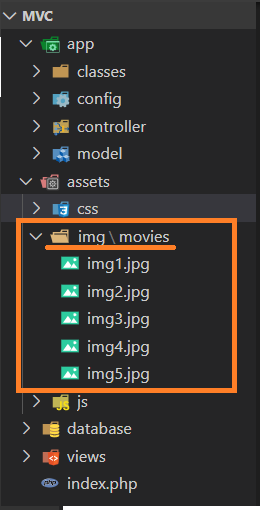</center>

Ahora revisemos el navegador
 
* Ubicamos la ruta http://locahost/mvc/index.php?c=movie<br>

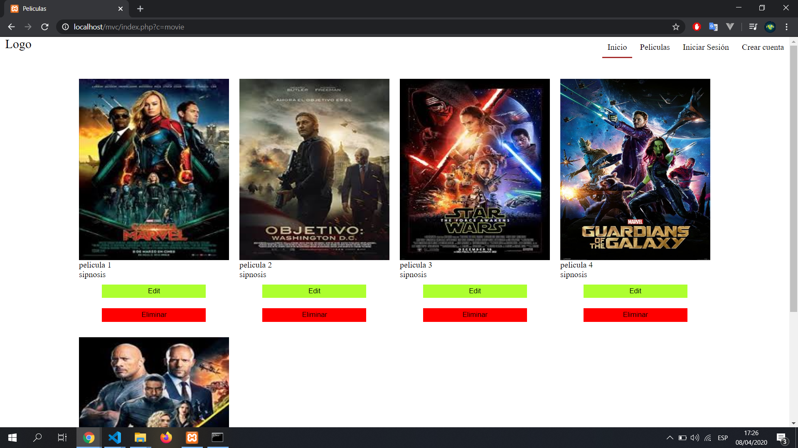

Ahora vemos los datos que están almacenado en la bd.

Podremos proseguir haciendos las funciones del controlador.

Ahora tendremos más métodos para hacerlos.

```php
<?php 
require_once MODEL."MovieModel.php";
class MovieController{
    private $movieModel;
    public function __construct(){
        $this->movieModel=new MovieModel();
    }
    // Iniciaremos con el método de index
// * Mostrar todas las películas
    public function index(){} // ya hecho
// * Guardar la imágen del la película
    public function saveImage(){}
// * Guardar películas
    public function save(){}
// * Eliminar una película
    public function delete(){}
// * Mostrar la vista para guardar película
    public function show_new(){}
// * Mostrar la vista para editar una película
    public function show_edit(){}
}
```

Seguimos con el método de la subida de imágenes, para eso crearemos métodos dentro del controlador, pero podrían ser escritas aparte y ser invocadas desde cualquier sitio.

Este método no será tan detallado.<br>
Recibe el nombre del campo de archivo en el que se envía la imágen y la ruta a guardar.

**MovieController.php** -> **saveImage() y validateExt()**

```php
public function saveImage($_name, $route){
    if(!$this->validateExt($_FILES[$_name]['name'])){
        return null;
    }
    opendir($route);
    $parts = explode(".",$_FILES[$_name]['name']);
    // con el final del explode que sería la extensión de la imagen
    $origen=  $_FILES[$_name]['tmp_name'];
    $destino= $route. time(). '.'.end($parts);//ends obtiene el último valor del arreglo
    move_uploaded_file($origen, $destino);
    // $_FILES[$_name]['type']; tipo de archivo
    return  $destino;
}
private function validateExt( $nombre){
    $patron = "%\.(gif|jpe?g|png|svg)$%i"; 
    return preg_match($patron, $nombre) ;
}
```

* 📦 [MVC] ->
    * 📦 [assets] ->
        * 📦 [img]
            * 📦 [movies]

Ahora crearemos el método de guardar película.

**MovieController.php** -> **save()**

Debemos recordar que sólo el administrador puede guardar, editar y eliminar, así que haremos una condición.

El envío de datos se hace desde un formulario, dentro de ese formulario existirá un campo de id, este se presentará en caso de que haya datos para editar, sino sólo se guardará uno nuevo.

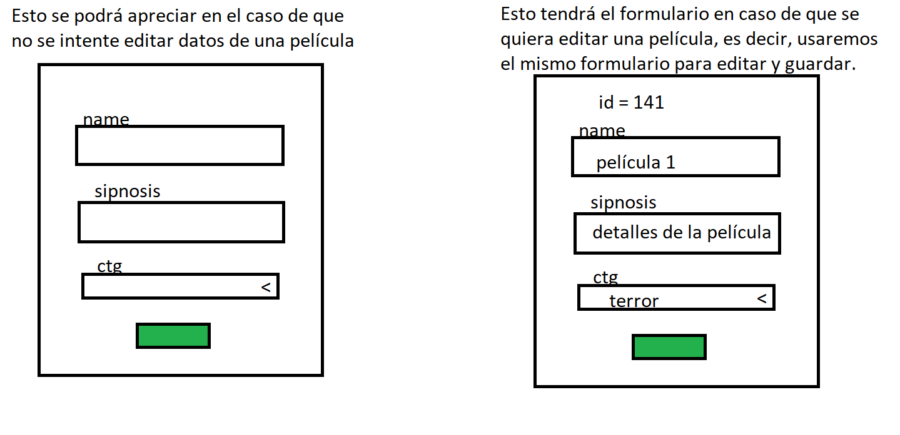

Listo, ahora sólo tendremos que conficionar si existe el id, en caso de que exista ese campo editaremos, de lo contrario guardaremos el dato

```php
public function save(){
    // Guardará sólo si el usuario existe
    if(isset($_SESSION['USER'])){
        // Ahora debemos tener en cuenta los valores que llegan
        if(
            isset($_REQUEST["name"]) && isset($_REQUEST["sipnosis"]) && 
            isset($_REQUEST["ctg"]) && isset($_FILES["img"])
        ){
            // Condicionamos que todos los campos hayan sido enviados
            // Ahora guardamos los datos en el modelo
            $this->movieModel->name_movie = $_REQUEST["name"];
            $this->movieModel->sipnosis = $_REQUEST["sipnosis"];
            $this->movieModel->id_ctg = $_REQUEST["ctg"];
                // Guardamos la imágen
            $this->movieModel->url_img = $this->saveImage("img", "assets/img/movies/");
            
            // Ahora verificamos si ha llegado un campo de id, para verificar si podremos editar
            if(!isset($_REQUEST["id_movie"])){
                // Guardar
                // Ahora guardamos
                $guardado = $this->movieModel->create();
                // COndicionamos si guardó
                if($guardado > 0){
                    header("Location:index.php?c=movie");
                }else{
                    header("Location:index.php?c=movie&a=show_new");
                }
            }else{
                // Editar
                $this->movieModel->id_movie = $_REQUEST["id_movie"];
                // Editamos
                $guardado = $this->movieModel->update();
                // COndicionamos si guardó
                if($guardado > 0){
                    header("Location:index.php?c=movie");
                }else{
                    header("Location:index.php?c=movie&a=show_edit");
                }
            }
        }
    }else{
        // Caso contrario redireccionará al formulario
        header("Location:index.php?c=movie&a=show_new");
    }
}
```

Ahora por partes
```php
if(isset($_SESSION['USER'])){
```

Empezamos por la primera condición, esto lo hacemos para darle algo de protección, ya que si no colocamos esa condidición cualquiera que no esté logueado podrá guardar datos.

<hr>

```php
 if(
    isset($_REQUEST["name"]) && isset($_REQUEST["sipnosis"]) && 
    isset($_REQUEST["ctg"]) && isset($_FILES["img"])
){
```

Esta condicional nos servirá para asegurar que todos los datos lleguen correctamente.

```php
else{
    // Caso contrario redireccionará al formulario
    header("Location:index.php?c=movie&a=show_new");
}
```

Caso contrario redireccionará nuevamente al formulario.

<hr>

```php
    $this->movieModel->name_movie = $_REQUEST["name"];
    $this->movieModel->sipnosis = $_REQUEST["sipnosis"];
    $this->movieModel->id_ctg = $_REQUEST["ctg"];
    $this->movieModel->url_img = $this->saveImage("img", "assets/img/movies/");
```

Después de hacer las validaciones de datos podremos guardarlos, todos los nombres que están dentro de $_REQUEST[''] son los nombres de los formularios.<br>
En la línea donde se guarda el nombre de la URL de la imágen se invoca el método para guardar la imágen y recibe el nombre del campo y la dirección donde se guardará.<br>
Así como usamos las variables superglobales $_REQUEST, $_POST, $_GET, tambíen podemos usar $_FILE para archivos enviados desde formularios.

<hr>

```php
    if(!isset($_REQUEST["id_movie"])){
```

Esta conficional se hace para poder condicionar si ha llegado un id de la película.<br>
Esto se debe a que si intentamos editar un registro, este tendrá un id que lo identifique, pero si es un nuevo registro, este no poseerá ese id.

Condicionamos si existe, pero estamos anteponiendo un **!**, eso quiere decir que negamos la respuesta, es decir ahora condicionamos si no existe.

```php
        $guardado = $this->movieModel->create();
        if($guardado > 0){
            header("Location:index.php?c=movie");
        }else{
            header("Location:index.php?c=movie&a=show_new");
        }
```

En caso de que no se envíe un id, invocaremos el método del modelo que guarda el registro, este retornará el número de cambios que haya hecho en la tabla, en caso de que no se haya guardado retornará 0, por eso es la condición > 0.

En caso de que se guarde redireccionará al índex del controlador de película, es decir, a la pantalla que presenta todas las películas.

Caso contrario se dirigirá al método para mostrar el formulario.

```php
        }else{
            // Editar
            $this->movieModel->id_movie = $_REQUEST["id_movie"];
            // Editamos
            $guardado = $this->movieModel->update();
            // COndicionamos si guardó
            if($guardado > 0){
                header("Location:index.php?c=movie");
            }else{
                header("Location:index.php?c=movie&a=show_edit");
            }
        }
```

Ahora entramos ej el caso de que exista un id, nos tocará guardar el valor del id para que los datos sean editados en donde coincida con ese id.

Posteriormente hará lo que se hace después de guardar en cuanto a la vistas.

<hr>

No podremos probar este método hasta que se haga la vista del formulario y se inicie sesión, así que terminemos los métodos para hacer las vistas.

**Nota: una falla de este método es que habrá que cambiar la imágen cada vez que se intente editar.**

    public function delete(){}
// * Mostrar la vista para guardar película
    public function show_new(){}
// * Mostrar la vista para editar una película
    public function show_edit(){}

**MovieController.php** -> **delete()**

Para este método tendremos que enviar el id por medio de la url y se eliminará, pero siempre y cuándo esté logueado.

```php
public function delete(){
    if(isset($_SESSION['USER'])){
        // En caso de que esté logueado se elimina el id
        $id = ( isset($_GET['id'])) ? $_GET['id'] : 0;
        $this->movieModel->id_movie = $id;
        $this->movieModel->delete();
    }
    header("Location:index.php?c=movie");
}
```

Para esto no hay muchas complicaciones.

<hr>

**MovieController.php** -> **show_new()**

Para este método sólo se tendrá que presentar la vista (Formulario), siempre y cuándo sea administrador.

**$categories = $this->movieModel->get_category();**

En esa línea estamos pidiendo los datos de las categorías por medio del model de película.

```php
public function show_new(){
    $pageName ="Nuevo";
    if(isset($_SESSION['USER'])){
        $categories = $this->movieModel->get_category();
        include_once HEADER;
        include_once VIEWS . 'movie/movieForm.php';
        include_once FOOTER;
    }else{
        header("Location:index.php");
    }
}
```

**MovieController.php** -> **show_edit()**

Este método es muy similiar, ya que incluirá el mismo formulario, pero aquí se consultará los datos de la película según el id que se envíe.

```php
public function show_edit(){
    if(isset($_SESSION['USER'])){
        // Obtenemos el id enviado por la url
        // localhos/mvc/index.php?c=movie&a?show_edit&id=131
        $id = ( isset($_GET['id'])) ? $_GET['id'] : 0;
        // Asignamos el id al modelo
        $this->movieModel->id_movie = $id;
        // Este método retornará nulo o un objeto con datos de la película
        $dato = $this->movieModel->queryOne();

        // Conficionamos si tiene datos
        if(!is_null($dato)){
            // En el caso de que tenga datos podemos guardalos en otra variable
            $pelicula = $dato;
        }
        $categories = $this->movieModel->get_category();
        // Luego pintaremos el formulario
        include_once HEADER;
        include_once VIEWS . 'movie/movieForm.php';
        include_once FOOTER;
    }else{
        header("Location:index.php?c=movie&a=show_new");
    }
}
```

Ahora que hemos terminado los controladores podemos hacer las vistas y la aplicación estará terminada.

## VISTAS

* 📦 [MVC]
    * 📦 [views]
        * 📦 [components]
            * 📄 nav.php -> plantilla html
        * 📦 [static]
            * 📄 index.php -> plantilla html
            * 📄 login.php -> plantilla html
        * 📦 [templates]
            * 📄 header.php -> plantilla html
        * 📦 [movie]
            * 📄 movie.php -> plantilla html
            * 📄 movieForm.php -> plantilla html
        
    * 📄 index.php

Hagamos unas modificaciones en **nav.php**

```html
<nav class="nav-bar">
    <p class="logo">Logo</p>
    <span class="btn-menu flex flex-end">=</span>
    <ul class="no-list nav">
        <li><a href="index.php" class="flex-center active">Inicio</a></li>
        <li><a href="index.php?c=movie&a=index" class="flex-center">Peliculas</a></li>
        <?php
            if(isset($_SESSION["USER"])){
                $user=$_SESSION["USER"];
        ?>
            <li><a href="index.php?c=movie&a=show_new">Agregar</a></li>
            <li><a href="#"><?php echo $user->username;?></a></li>
            <li><a href="index.php?c=user&a=logout">Cerrar sesión</a></li>
        <?php
            }else{
        ?>
            <li><a href="index.php?c=user&a=view" class="flex-center">Iniciar Sesión</a></li>
        <?php }?>
    </ul>
</nav>
```

Condicionamos las direcciones, en caso de que exista un usuario presenta opciones adicionales, caso contrario presenta la opción de iniciar sesión.

📦 [views] -> 📦 [static]-> **📄 index.php**

```html
<?php
// Condicionamos en caso de que haya un error y luego imprimimos
if(isset($error)){
    echo '<p class="txt-center">'.$error.'</p>';
}
?>
<div class="flex-center flex">
    <section class="flex-y flex">
        <h2 class="txt-center">Iniciar sesión</h2>
        <form action="index.php?c=user&a=login" method="post" class="grid grid-gap-10">
            <input name="username" placeholder="Username">
            <input type="password" name="password" placeholder="password">
            <div class="grid">
                <input type="submit" value="login" class="btn-c edit">
            </div>
        </form>
    </section>
</div>
```

Presentamos formularios con campos de usuario y contraseña.
* La etiqueta form tiene el atributo de action con el valor de index.php?c=user&a=login, eso indica que al momento de darle clic al botón hará la petición al servidor y requiere ese controlador con la acción de login a ejecutar.

Ahora podemos hacer la prueba para inicia sesión ya que el controlador nos manejará la lógica y presentará un mensaje de error en caso de que los datos estén mal.

<hr>
Veamos lo que pasa cuando colocamos datos erróneos e intentamos iniciar sesión.

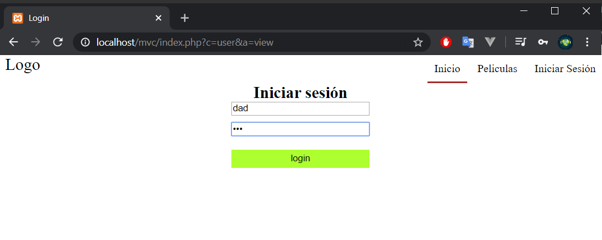


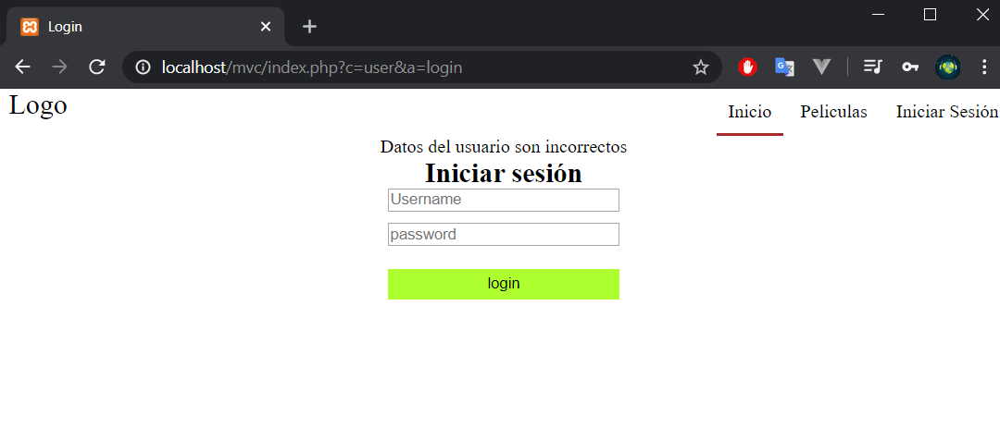

Nos muestra el mensaje de error que hemos indicado en el controlador.

<hr>

Ahora veamos que pasa cuando los datos son correctos.

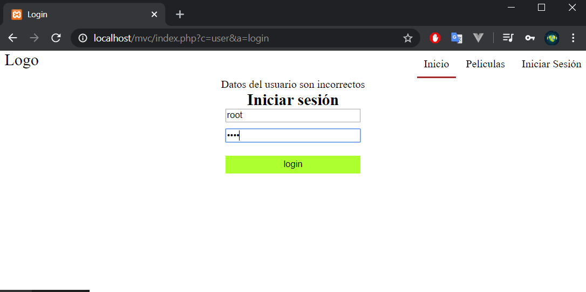

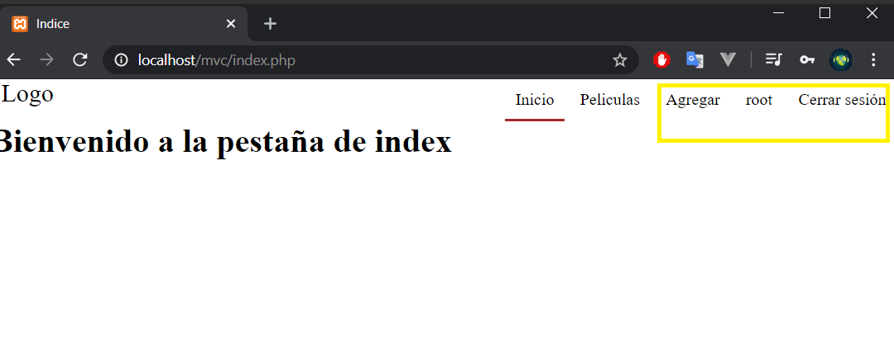

Debido a que los datos son correctos el controlador permite el registro en la variable sesión el usuario.<br>
Recordemos que la consulta devuelve un objeto con el atributo de username.

Tendremos (User){ username="root"} en la variable de sesión, ahora la podemos usar en toda la aplicación hasta que se elimine, que es lo que hace cerrar sesión, esto elimina la sesión y la pantalla volverá al inicio.

Ahora veamos qué hace la opción de películas.

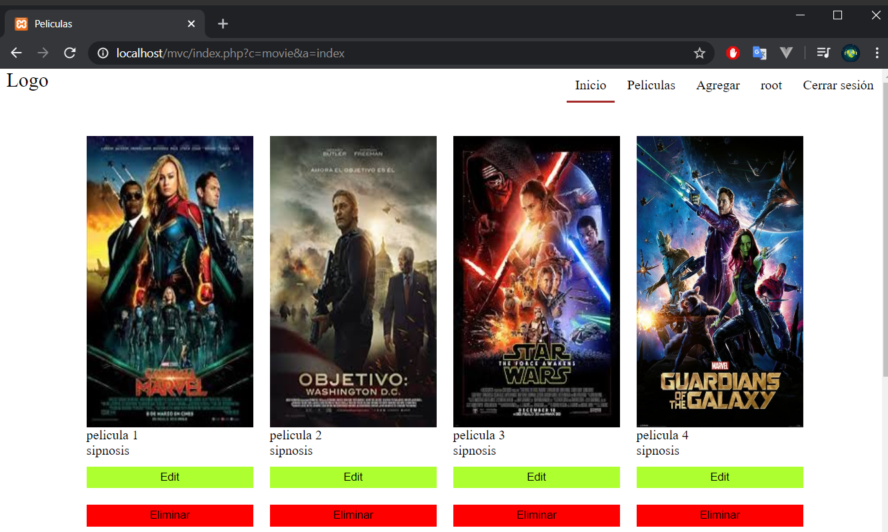

Llama al controlador de película y a su método de index el cuál muestra todos los datos renderizados.

Ahora modificaremos el fomulario para guardar y editar.

📦 [views] -> 📦 [movie]-> **📄 movieForm.php**

```html
<div class="flex flex-center">
    <div class="container" style="width:50%">
        <form action="index.php?c=movie&a=save" method="post" enctype="multipart/form-data" class="flex flex-y">
            <?php if(isset($pelicula) ){    ?>
                <input type="hidden" name="id_movie" value="<?php echo isset($pelicula)?$pelicula->id_movie:''?>">
            <?php }
            ?>
            <input 
                type="text" 
                name="name" 
                class="input"
                value="<?php echo isset($pelicula)?$pelicula->name_movie:''?>"
                placeholder="Nombre de la película"
            >
            <textarea 
                class="input"
                name="sipnosis" 
                placeholder="Text"><?php echo isset($pelicula)?$pelicula->sipnosis:''?></textarea>

            <input 
                type="file" 
                name="img"
            >

            <select 
                name="ctg"
                class="input"
            >
                <?php
                    foreach($categories as $ctg){
                        ?>
                        
                        <option 
                            value="<?php echo $ctg->id_ctg?>" 
                            <?php 
                                if(isset($pelicula)){
                                    if($ctg->id_ctg==$pelicula->id_ctg)
                                        echo "selected";
                                }
                            ?>
                        >
                            <?php echo $ctg->name_ctg?>
                        </option>
                        <?php
                    }
                ?>
            </select>
            <input 
                class="btn-c edit"
                type="submit" 
                value="<?php echo $pageName;?>"
            >                
        </form>
    </div>
</div>
```

Ahora analicemos lo más importante

```html
<form action="index.php?c=movie&a=save" method="post" enctype="multipart/form-data" class="flex flex-y">
```

Form

* action="index.php?c=movie&a=save"
    * Este atributo de form permite enviar los datos a la url que le indicamos, le enviaremos al controlador MovieController y ejecutaremos el método save.
* method="post"
    * Enviaremos los datos por post.
* enctype="multipart/form-data"
    * Le indicaremos que aparte de texto plano también enviaremos archivos.

```html
<?php 
if(isset($pelicula) ){    
?>
    <input type="hidden" name="id_movie" value="<?php echo isset($pelicula)?$pelicula->id_movie:''?>">
<?php } ?>
```

Estas líneas incluyem código php, entonces, esto lo usaremos de la siguiente manera, al momento de agregar nuevos datos aparecerán todos los campos vacíos, pero al momento de editar tendremos que tener los datos existentes.

Entonces significa que cuando editemos tendremos una variable con el dato de dicha película, por eso está la condicional llamada $película, que es la que tendrá los datos para editar, pero cuando se agregue uno nuevo esta variable no tendrá datos, por eso no entrará a la condicional y el input que está dentro no se mostrará.

El input dentro de esa condicional indica el **id** de la película, el cual es necesario para saber qué acción realizar en el controlador.

Ahora ese input muestra varios atributos.

* input
    * type = "hidden"
        * esto nos indica que ese campo va a estar oculto, no visible para el usuario, pero estará ahí.
    * name="id_movie"
        * Este será el nombre con el cuál el controlador recoja el dato ya sea con $_REQUEST o por _$_POST
        * Ahora esto

```php
 value="<?php echo isset($pelicula)?$pelicula->id_movie:''?>"
```

Este atributo va a indicar el valor del campo, pero dentro de las comillas vemos un código en php, esto lo incluimos dentro de las comillas para poder imprimir el valor que existe en caso de que se vaya a editar.

Se hará un **echo** del atributo **id_movie** del objeto **pelicula** si que existe "**isset(pelicula)**" el objeto pelicula, caso contrario "**:**" imprime un contenido vacío.

<hr>

```html
<input 
    type="text" 
    name="name" 
    class="input"
    value="<?php echo isset($pelicula)?$pelicula->name_movie:''?>"
    placeholder="Nombre de la película"
>
```

Algo similar para con ese campo.

* Es de tipo texto.
* Tiene el nombre **name**.
* Y el valor imprimirá el atributo **name_movie** (campo nombrado así en la base de datos.) del objeto **pelicula** si es que exite "**isset($pelicula)**", caso contrario se deja vacío el campo   **:''** .

<hr>

```html
<textarea 
    class="input"
    name="sipnosis" 
    placeholder="Text"
    ><?php echo isset($pelicula)?$pelicula->sipnosis:''?></textarea>
```

Con el textarea ocurre algo diferente, este no tiene un atributo value, su valor se imprime dentro de las etiquetas, y no es conveniente dejar saltos de línea entre las etiquetas debido a que lo tomaría como valor.
<hr>

```html
<input 
    type="file" 
    name="img"
>
```

En este input se insertará la imágen y en esta etiqueta no existe el atributo value, por lo que no se podrá setear el valor de la url.

<hr>

```html
<select 
    name="ctg"
    class="input"
>
    <?php
        foreach($categories as $ctg){
            ?>
            
            <option 
                value="<?php echo $ctg->id_ctg?>" 
                <?php 
                    if(isset($pelicula)){
                        if($ctg->id_ctg == $pelicula->id_ctg)
                            echo "selected";
                    }
                ?>
            >
                <?php echo $ctg->name_ctg?>
            </option>
            <?php
        }
    ?>
    
</select>
```

En la campo select no hay nada de novedoso, pero el contenido que tiene dentro de las etiquetas es algo medio complejo.

* Primero observamos un foreach, que nos indica que recorrerá un arreglo, dicho arreglo es la variable $categories que mostrará las categorías almacenadas en la base de datos, que han sido obtenidas por el modelo de peliculas.

* Ahora por cada recorrido tendremos el objeto $ctg el cuál contendrá el id y el nombre de la cateogría

* Cerramos el código en php, pero dejamos abierto la llave por lo que incluiremos nuevo código, al finalizar volveremos a abrir la etiquetas de php para cerrar la llave, esto no es ni un problema.
* Dentro de aquello pondremos una etiqueta **option** de html.
    * Ahora esa etiqueta tendrá un valor, el cuál será el id de dicho objeto categoría, incluyendo código php dentro de las comillas.
    * Todavía no se cierran la etiqueta inicial.
    * Las siguientes líneas de código se hacen para que se imprima el atributo selected para que esa opción se seleccione automáticamente.
    * Podemos poner código php, ahora condicionamos si existe el objeto película, ya que esto sólo sirve cuando se editará.
    * En el caso de que exista podemos preguntar si el id de la categoría es igual al id de la categoría de la película.

<hr>

```html
<input 
    class="btn-c edit"
    type="submit" 
    value="<?php echo $pageName;?>"
> 
```

Ahora tenemos el input de tipo submit, es el que enviará los datos al servidor.<br>Este tomará el valor del nombre de la página para que sea dinámico y muestre si se va a editar o guardar.

Listo, eso es todo en cuanto al formulario, si todo va correcto nos guardará los datos en la base de datos y nos mostrá en la pantalla de inicio.

<hr>

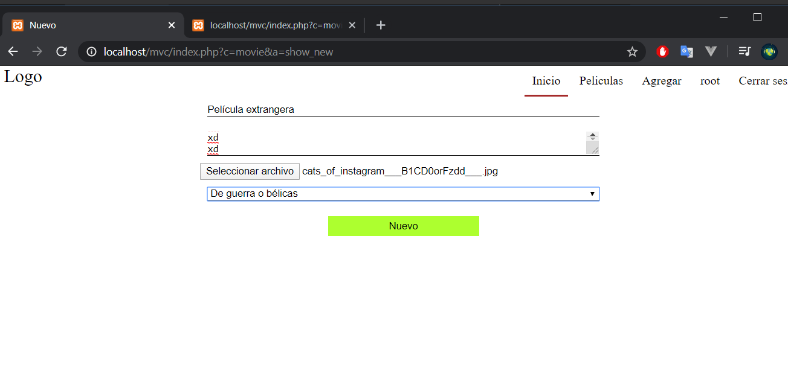

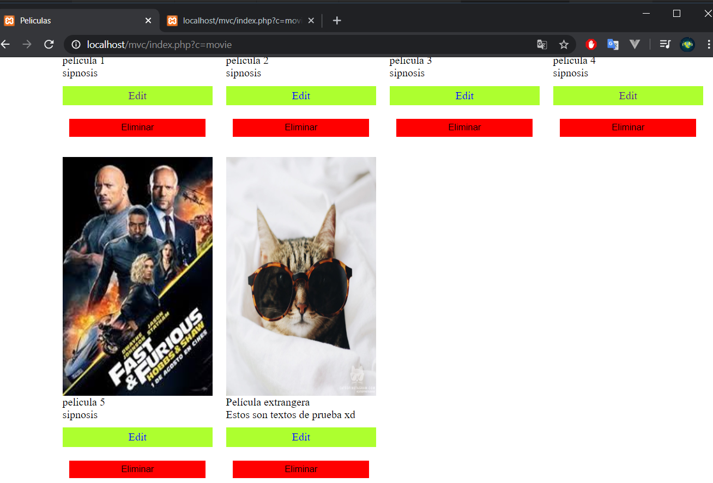

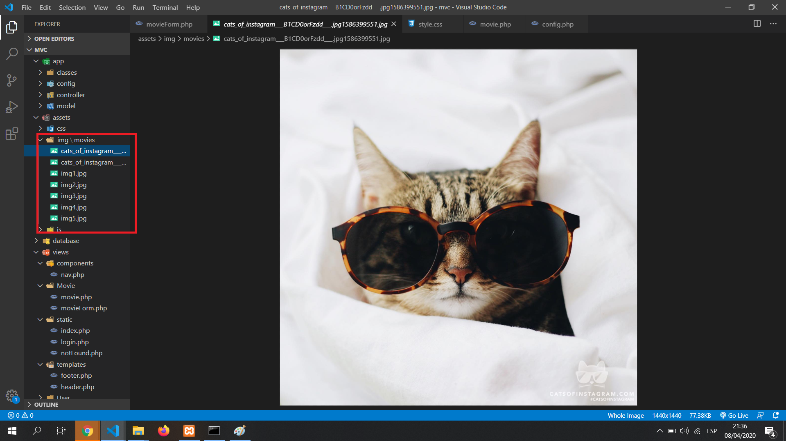

Todo ha salido bien, y vemos que la imágen se ha guardado en la carpeta de movie, con un nombre diferente a la original, eso pasa porque al guardar la imágen se le añade una función que devuelve el tiempo **time()** de php.

Ahora modificaremos el archivo de plantilla **movie.php**.

📦 [views] -> 📦 [movie]-> **📄 movie.php**

```html
<div class="movies">
    <div class="panel">
        <!-- Incluimos código php para hacer el ciclo -->
        <?php foreach ($peliculas as $key => $pelicula) {
            $url_img =  ROUTEAPP."/" .$pelicula->url_img;
        ?>
            <div class="card">
                <div class="picture">" alt=""></div>
                <div class="body">
                    <p>Nombre: <?php echo $pelicula->name_movie ?> </p>
                    <p>Sipnosis: <?php echo $pelicula->sipnosis ?> </p>
                    <p>Género: <?php echo $pelicula->name_ctg ?> </p>
                </div>
                <?php
                if(isset($_SESSION['USER'])){
                    ?>
                <div class="actions flex flex-center flex-y w-100-p">
                    <a class="btn-c edit" href="index.php?c=movie&a=show_edit&id=<?php echo $pelicula->id_movie ?>">Edit</a>
                    <a class="btn-c remove" href="index.php?c=movie&a=show_edit&id=<?php echo $pelicula->delete ?>">Eliminar</a>
                </div>
                <?php
                }
                ?>
            </div>
        <?php
        }?> 
    </div>
</div>
```

Las líneas modificadas fueron:

```html
<?php
    if(isset($_SESSION['USER'])){
        ?>
    <div class="actions flex flex-center flex-y w-100-p">
        <a class="btn-c edit" href="index.php?c=movie&a=show_edit&id=<?php echo $pelicula->id_movie ?>">Edit</a>
        <a class="btn-c remove" href="index.php?c=movie&a=delete&id=<?php echo $pelicula->id_movie ?>">Eliminar</a>
    </div>
    <?php
    }
?>
```

Le hemos añadido links la cuál llama a métodos diferentes del controlador de película (show_edit, delete), ahora ejecutaremos el de elmiminar

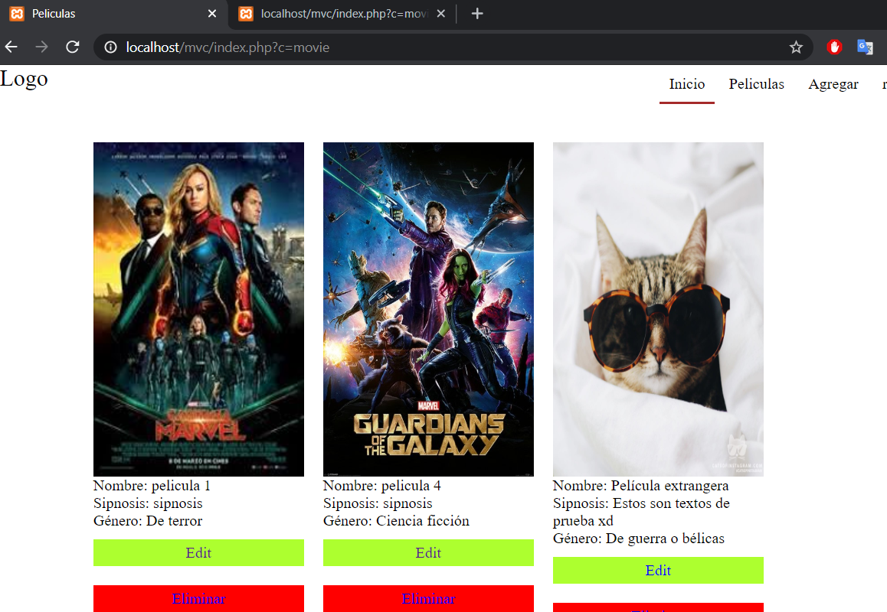

Ahora podremos ver los cambios en el gestor de base de datos entrando a http://localhost/phpmyadmin/.

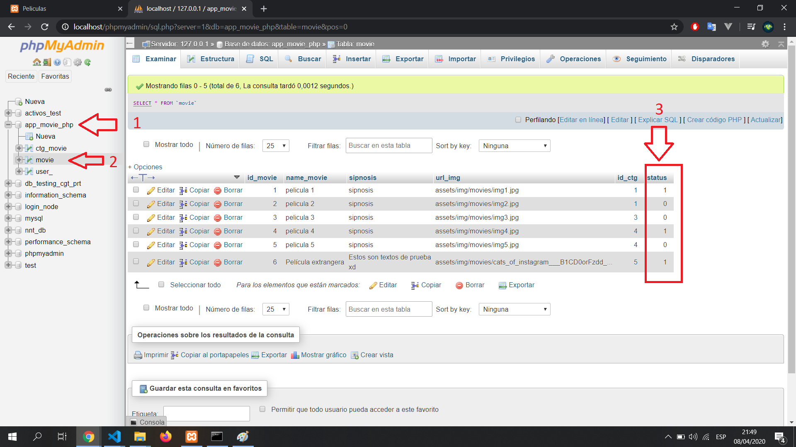

* 1. Entramos a la base de datos.
* 2. Entramos a la tabla de movie.
* 3. Vemos es estado, recordemos que eliminar cambia el estado de 0 a 1, y el query consulta a todos los datos siempre y cuando tengan el valor de 1, esta es una simulación de eliminación ya que no es aconsejable eliminar los datos.

Ahora intentaremos en editar, así que pulsaremos sobre una película en su botón editar.

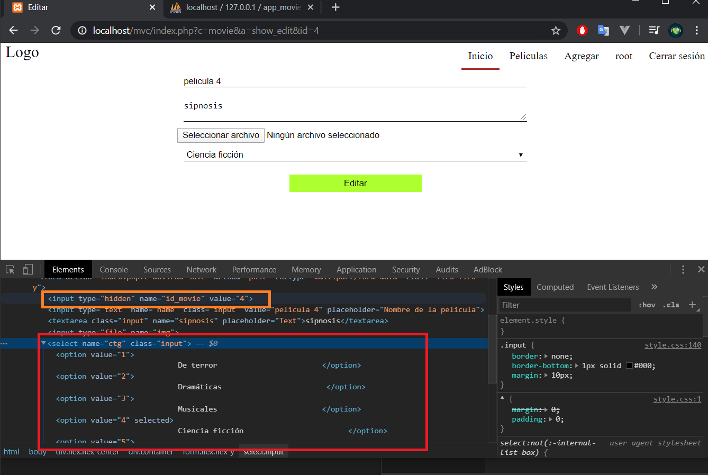

Vemos que nos aparecen los datos originales que tenía la película, y en las opciones de desarrolladores observamos que tenemos la etiqueta con el id del post, y también las opciones y una de ellas tiene **selected** en su etiqueta, por ende esa opción tomará la etiqueta **sekected** (ver en el navegador).

Ahora cambiaremos los datos.

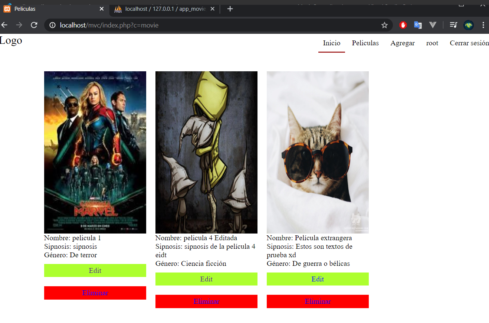

Listo ya está, al momento de cerrar sesión no se mostrarán las opciones del administrador.

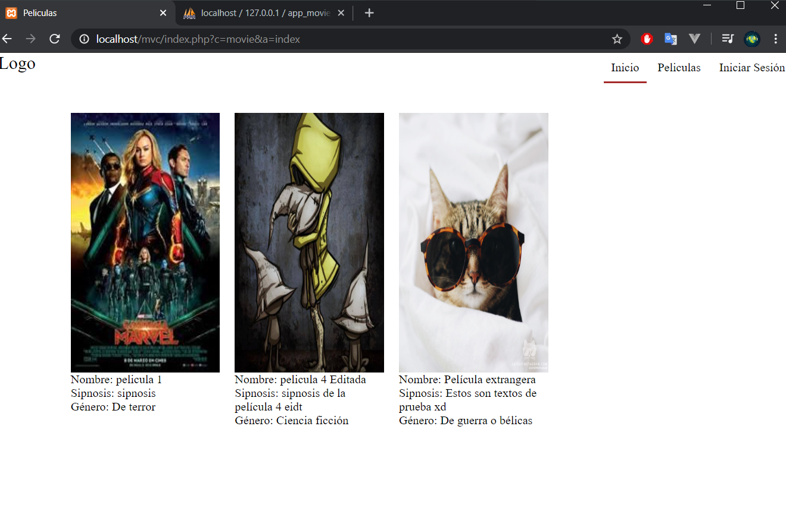

FIN :´v